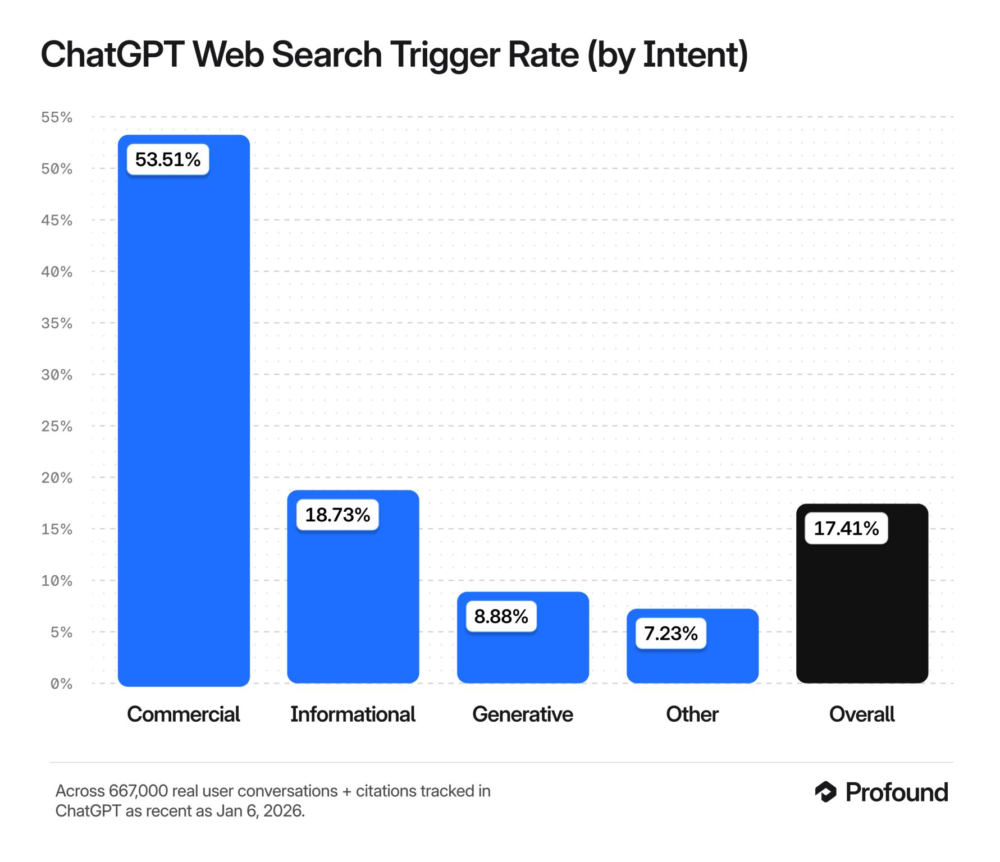

# Thesis Research Outline
## Grounding Behavior in LLM‑Mediated Commercial Search: How ChatGPT and Gemini Select and Cite Web Sources

**Author:** [Your Name]
**Date:** January 2026
**Status:** Research Notes / Working Draft

---

**What we empirically observe and measure (high-level):**
- **Cross-model grounding**: Gemini vs. ChatGPT
- **Cross-deployment grounding**: ChatGPT **Personal vs Enterprise**
- **Rank effects**: how grounding/citation choices relate to **SERP position distributions** (position bias)
- **Selection bias in sources**: differences between the **available menu** (Top‑N SERP) vs the **selected order** (cited set), measured via **Content DNA enrichment** of cited and non-cited URLs
- **Visibility gaps**: "invisible/shadow" citations (cited URLs missing from the defined Top‑N baseline), analyzed separately from within-SERP drift

## Core Research Question
**RQ1:** *How does grounding behavior manifest in LLM-generated product recommendations, and how does it vary across conditions we can observe (deployment context and/or model)?*

### Operational definition (what "grounding behavior" means in this thesis)
Grounding behavior is the measurable pipeline from **retrieval → selection → citation → final text**, using observable artifacts:
- **Retrieved candidate set** (where available): sources the system pulled/considered
- **Selected set**: sources that "survive" selection (cited/attached)
- **Claim linkage**: which textual claims map to which sources (claim-to-link mapping)
- **SERP support**: whether selected sources are actually present in external SERPs (Bing/Google)
- **Source-to-output fidelity**: whether products mentioned in retrieved listicles are carried into the final recommendations

### Sub-questions (decompositions of RQ1, not separate topics)
- **RQ1a (selection + visibility)**: How do **cited vs additional vs retrieved-only/invisible** sources differ in domain/type, and how does this differ by **enterprise vs personal** runs on chatGPT results?
- **RQ1b (external support)**: How often do selected citations appear in **Top‑N SERPs** (Bing/Google overlap; Gemini "survival" in Top‑20)?
- **RQ1c (selection bias & DNA)**: Does the model exhibit a statistically significant preference for specific **Content DNA features** (e.g., tables, numbered lists, freshness) when selecting from the retrieved "Menu," and how does this preference vary between **GPT Personal, GPT Enterprise and Gemini**?
- **RQ1d (listicle uptake / fidelity)**: When listicles are retrieved, which listicle-mentioned products are **selected vs ignored** in the final response (uptake rate, rank bias, host-bias), and how does this differ by run type?

### Role of external systems (clarify scope)
- **Bing**: baseline "human web" retrieval/ranking surface used as a **measurement instrument** for rank/visibility and "visibility gaps" (**Top‑200**).
- **Google (SerpApi)**: control baseline for Gemini fan-out queries and sensitivity checks (**Organic-only** vs including non-organic result types like **Video/PAA/Discussions**).
- **Gemini**: optional cross-model baseline for grounding mechanics (has explicit `groundingMetadata` and claim-support mapping); not an enterprise/personal split unless we create our own conditions.

---

# Part 1: Introduction & Motivation

## 1.1 Market Context & Motivation (Ahrefs Benchmark)

- **The Macro Shift (8-Month Trend):** According to data from [Ahrefs (ChatGPT vs. Google)](https://chatgpt-vs-google.com/) analyzing **74,752 websites** between **June 2025 and January 2026**, total search traffic across the panel dropped by **7.5%** (from 494M to 457M visits).
- **The AI Growth Engine:** In the same timeframe, referral traffic from AI chatbots grew by **27%** (from 2.9M to 3.7M visits).
- **Implication for visibility:** Although AI referral traffic is growing rapidly, conventional search still dominates the referral landscape. This suggests that, in many cases, LLM answers remain downstream of search visibility: the model can only cite what it retrieves.
- **Thesis Motivation:** This study focuses on the **micro-level mechanics** of this transition — how assistants ground product recommendations in web sources, and how the retrieval-to-citation pipeline shapes which sources and products appear in the final response.

## 1.2 Theoretical Framework: From SEO to GEO

*Tracing the evolution of information retrieval from keyword matching to generative synthesis.*

### 1.2.1 The Evolution of Search Optimization
**SEO (Search Engine Optimization)** is the established practice of optimizing content for visibility in organic search results through relevance, authority signals, and technical performance. As LLMs increasingly mediate search interactions, a parallel optimization practice is emerging: tailoring content to be retrieved, selected, and cited within AI-generated answers. The industry has not converged on a single term for this — common labels include **GEO** (Generative Engine Optimization), **AEO** (Answer Engine Optimization), **AI SEO**, **AIO** (AI Optimization), and **LLMO**. Throughout this thesis we adopt **GEO** following Aggarwal et al. (2024), as it is the most established term in academic literature, but the underlying concept is the same across labels: optimizing content so that it survives the retrieval-to-citation pipeline of RAG-based search systems.

### 1.2.2 The Genesis and Evolution of RAG (Retrieval-Augmented Generation)
- **The "Stochastic Parrot" Era (Pre-2023):** Early LLMs relied purely on "parametric knowledge"—static information frozen at the time of training. This led to the "hallucination problem" and the "stale data" bottleneck.
- **The Reasoning vs. Knowledge Split:** The industry realized that LLMs are better at **reasoning** (logic, synthesis, formatting) than being a **database**. RAG was developed to decouple these functions.
- **The RAG Workflow:**
    1. **Retrieval:** The model identifies it needs external info and generates a search query.
    2. **Augmentation:** The search results (grounding chunks) are injected into the model's context window.
    3. **Generation:** The model reasons over the provided text to synthesize a factual response.
- **Why RAG became the Standard:**
    - **Factuality:** Provides a "paper trail" (citations) for every claim.
    - **Efficiency:** Small models + RAG often outperform massive models without RAG.
    - **Freshness:** The only way to handle dynamic data (prices, news, product releases).

### 1.2.3 Sam Altman's "Tiny Model" Vision
- At Snowflake Summit 2025, Sam Altman described the framework he uses to think about AI's trajectory: *"a very tiny model with superhuman reasoning, 1 trillion tokens of context, and access to every tool you can imagine"* ([Source: Maginative on YouTube](https://www.youtube.com/watch?v=qhnJDDX2hhU)). The model does not need to contain knowledge — just the ability to reason over externally provided information.
- **Thesis Connection:** This vision confirms that the future of search is not the death of the web, but the transformation of the web into a **distributed memory layer** for AI orchestrators.

### 1.2.4 The Economic & Technical Necessity of Retrieval
- **The Compute Wall:** Inference (LLM "thinking") is exponentially more expensive than Retrieval (traditional search indexing).
- **The Scaling Limit:** You cannot train a model every hour to keep up with the web. Retrieval is the only scalable solution for real-time information.
- **Thesis Argument:** GEO is not a replacement for SEO; it is **SEO's final form**. Search is the "cheaper, better, faster" engine that feeds the LLM's reasoning core.

### 1.2.5 The Structural Pivot: From "Search" to "Grounding"
In August 2025, Microsoft decommissioned the legacy Bing Search APIs and migrated to **"Grounding with Bing Search"** as part of the Azure AI Agents ecosystem. The rebranding from "search" to "grounding" reflects a conceptual shift: unlike traditional search ranking, which optimizes for human click-through rates, **grounding** is the process of anchoring an LLM's response in real-time, verifiable web data to reduce hallucinations and ensure factual accuracy.

This shift has fuelled industry discussion around a "Two-Web" reality — a **Human Web** optimized for SEO, ads, and engagement, alongside an emerging **Agent Web** optimized for machine-readable structure and information density. Infrastructure providers are already building for this split: Martinho & Allen (2026) describe Cloudflare's "Markdown for Agents" feature, which uses HTTP content negotiation to serve markdown instead of HTML when AI crawlers request a page, reducing token consumption by up to 80%. However, it remains unclear whether this format-level distinction actually affects LLM citation behavior. Punturo (2026) tested this directly in a controlled A/B experiment across 381 pages and found **no statistically significant advantage** for markdown over standard HTML in AI bot traffic, suggesting that current LLMs are already effective at parsing HTML and that the "two-web" divide may be more about infrastructure efficiency than content visibility.

## 1.3 The Commercial Catalyst for RAG

*Why product recommendations are the "Front Line" of Generative Search.*

### 1.3.1 Industry Benchmark: ChatGPT Web Search Trigger Rates (Profound Analysis)
*To contextualize our study, we refer to industry-wide telemetry from **Profound** (captured as of Jan 6, 2026), which analyzes trigger rates across 667,000 real-user conversations.*



- **Commercial Intent as the Primary Driver**: Web search is triggered in **53.51% of Commercial queries**, compared to only 18.73% for Informational and 8.88% for Generative queries.
- **Overall Trigger Rate**: Across all intents, the baseline trigger rate is **17.41%**.
- **Thesis Alignment**: Our decision to filter for **high commercial intent** (product recommendations) aligns with this industry data, as this is the segment where RAG/Grounding is most active and commercially impactful.
- **The "Winnable" Arena:** Because commercial intent requires real-time data (pricing, availability, reviews), it is the primary driver for RAG adoption. This makes product recommendations the most critical area for studying the shift from SEO to GEO.

### 1.3.2 The GEO Industry Landscape: Citation Tracking & "Share of Model"
- **The Rise of GEO Analytics**: Emerging platforms (e.g., **Profound**, **Peec.ai**) are shifting the industry from "Share of Voice" (traditional search) to "Share of Model" (generative search).
- **The Listicle as the "Critical Node"**: Our research places extreme emphasis on listicles because they are the primary "on-ramp" for product citations. In the GEO ecosystem, being cited in a top-tier listicle is no longer just about referral traffic; it is a prerequisite for being "seen" by the RAG orchestrator.
- **Quantifying the Value of a Citation**: By measuring the **Bias Multiplier** (how much more likely a cited product is to be selected vs. a random one) and **Host Exclusion** (the risk of being ignored if you are the host), we provide the first empirical framework for what these citation-tracking tools are actually measuring.
- **The "Gold Rush" of AEO/GEO:** The rapid rise of companies like **Profound** and **Perplexity AI** underscores the industry's recognition that the "Answer Engine" is the next multi-billion dollar shift in tech.
- **Venture Capital Validation:** A landmark moment occurred on August 12, 2025, when **Profound raised $35 million in a Series B round led by Sequoia Capital**, bringing its total funding to $58.5 million ([Fortune, 2025](https://fortune.com/2025/08/12/ai-search-startup-profound-raises-35-million-series-b-sequoia/)).
- **The "Salesforce of AI Search":** This funding round validated the concept of building a "generational company" centered on helping brands monitor and optimize for how they surface in AI-generated responses across models like ChatGPT, Gemini, and Claude.
- **The European Challenger — Peec AI:** In November 2025, Berlin-based **Peec AI** raised **$21 million in a Series A led by Singular**, bringing its total funding to $29 million ([TechCrunch, 2025](https://techcrunch.com/2025/11/17/as-consumers-ditch-google-for-chatgpt-peec-ai-raises-21m-to-help-brands-adapt/)). Founded in early 2025, Peec grew to **$4M ARR in 10 months** with 1,300 companies on its platform (including ElevenLabs, Chanel, and Axel Springer), explicitly positioning itself in the **Generative Engine Optimization (GEO)** category. The speed of Peec's traction—alongside Profound's Sequoia-backed round—confirms that AI search analytics is rapidly consolidating into a recognized market category, not a niche experiment.
- **The Hype vs. Reality:** While the hype is centered on "killing search," our research suggests the reality is a **deeper integration** where search becomes the infrastructure for AI.
- **The High-Intent Conversion Hypothesis**: Preliminary industry observations suggest that while AI-driven traffic volume is currently lower than traditional search, the **conversion rate** and **purchase intent** of LLM-referred users can be significantly higher — implying that LLM citations act as a "pre-qualified" lead source, making the mechanics of selection (which we study here) commercially critical.

## 1.4 Retrieval Environments & Deployment Contexts
*Defining the specific interfaces and constraints of the models under study.*

### 1.4.1 ChatGPT: UI-Based Network Instrumentation (Personal vs. Enterprise)
- **Deployment Context**: We study ChatGPT as a consumer-facing product accessed via the standard web interface (`chatgpt.com`).
- **Instrumentation Method**: Because OpenAI does not expose grounding metadata (fan-out queries, retrieved snippets) via its public API, we used **Network Payload Inspection** (Chrome DevTools protocol) to capture the raw event stream of the production UI.
- **Session Isolation**: All ChatGPT prompt runs were conducted in **Temporary Chat** mode to prevent conversation history and memory from influencing retrieval or generation behavior across runs.
- **Personal vs. Enterprise**:
    - **Personal**: Executed on a **ChatGPT Plus** subscription in the user's **personal workspace**. OpenAI's [general documentation](https://openai.com/index/introducing-chatgpt-search/) describes ChatGPT search as leveraging "third-party search providers" (plural), leaving the exact provider mix unspecified.
    - **Enterprise**: Executed through a **ChatGPT Enterprise organization account**. OpenAI's [Enterprise documentation](https://help.openai.com/en/articles/10093903-chatgpt-search-for-enterprise-and-edu) explicitly names **Bing** as the search provider, restricting retrieval to the Azure/Bing ecosystem.

### 1.4.2 Gemini: API-Based Grounding (Vertex AI)
- **Deployment Context**: Unlike ChatGPT, Gemini was studied via the **Vertex AI / Google AI Studio API** (Gemini 1.5 Pro/Flash).
- **Instrumentation Method**: We utilized the API specifically to access the **`groundingMetadata`** object, which is not fully transparent in the consumer UI.
- **Reliability of Data**: The API provides a 'cleaner' laboratory environment, exposing the exact `groundingChunks` (retrieved snippets) and `groundingSupports` (segment-to-chunk mapping) required for high-fidelity grounding analysis.

---

# Part 2: Methodology & Tools

## 2.1 Data Collection Pipeline

| Component            | Description                                                                      |
| -------------------- | -------------------------------------------------------------------------------- |
| **Queries**          | 79 product recommendation queries × 3 runs each (237 total runs)                 |
| **ChatGPT Data**     | Full responses with inline citations, additional links, and recommended products through chrome dev tool network packet inspection |
| **Bing Data**        | Top 200 results                                                                  |
| **Gemini Data**      | Full `groundingMetadata` (Chunks vs. Supports) + Fan-out Queries                 |
| **Google SERP**      | SerpApi pagination until **≥20 Organic** results are collected (often ~3 pages), with Video/PAA/Discussions retained as diagnostic buckets |
| **Content Fetching** | Node.js fetcher + Browser extension for blocked pages (Master Content Library)   |

### 2.1.1 Selection of the Research Query Set
- **High-Volume Real-World Prompts:** Our dataset consists of **79 unique product recommendation prompts** (e.g., "Best AI video translators", "Top-rated transcription software"), sourced from two platforms: **65 prompts from Profound** (real user conversations with ChatGPT) and **14 prompts from Ahrefs** (high-volume keyword clusters).
- **Methodology for Selection:**
    - **Keyword Clustering:** Using **Ahrefs** to identify high-intent keyword clusters and derive 14 representative prompts from search volume data.
    - **Prompt Volume Analysis:** Leveraging **Profound's** Prompt Volumes feature to select 65 prompts derived from real user conversations with ChatGPT. Note: Profound states that surfaced prompts may be rewritten for anonymity or clarity, so these are representative of real user intent rather than verbatim transcripts.
    - **Deliberate Intent Filtering:** From the broad set of available user prompts, we **deliberately filtered for high commercial intent**. This ensures the study reflects the specific segment of search where AI synthesis is most active and where the "Extractive Nature" of the model is most visible.
    - **Domain Expertise:** Queries were focused on the **AI and Software-as-a-Service (SaaS)** sectors — particularly **speech and language technology** (speech-to-text, live transcription, voice translation, text-to-speech) — a domain where the author has significant professional expertise, allowing for more nuanced qualitative analysis of the "Signal vs. Noise" in results.
- **Experimental Rigor:** Each of the 79 prompts was executed in **3 independent runs** (with a 4th run added only in cases of technical failure or RAG non-triggering) to analyze the consistency and stochastic nature of the retrieval process.

**Intent-based prompt clusters.** Although the 79 prompts span 9 fine-grained `parent_keyword` categories, they reduce to 4 functional clusters when grouped by user intent:

| Cluster | Categories included | Count | % |
|---|---|---|---|
| **Live / real-time** | live translation (23), live transcription (2) | **25** | **31.6%** |
| **Post-production translation** | video translation (11), voice translation (9), video translator (4) | **24** | **30.4%** |
| **Post-production transcription / STT** | audio transcription (16), speech to text (4), video transcription (1) | **21** | **26.6%** |
| **Text-to-speech** | text to speech (9) | **9** | **11.4%** |

The first three clusters are roughly balanced (27–32%), with TTS as a smaller tail. Note that some voice translation prompts (e.g., P014 "best app for voice translation", P042 "real-time voice translator") have clear live intent and could be reclassified to the live cluster, which would push live to ~37% and post-production translation to ~23%. The assignment above preserves the original `parent_keyword` boundaries.

**Example prompts by cluster:**

| Cluster | Example prompts |
|---|---|
| Live / real-time | "Is there a real time audio to text translation?" (P007), "Is there a Windows application for live translation during calls in Google Meet?" (P034), "什么实时翻译软件好用？" (P032) |
| Post-prod translation | "Which free AI would you recommend for translating my video?" (P001), "Can you suggest a free website or program that can translate my 20-minute video and add subtitles?" (P018), "What is the AI app that changes the language of videos?" (P037) |
| Post-prod transcription / STT | "I have an audio file and need to know which app or AI tool can transcribe it" (P004), "What are the best free audio to text transcription tools?" (P070), "What are the top 3 speech-to-text transcription tools?" (P079) |
| TTS | "Can you recommend a text-to-speech service that generates conversations with multiple voices?" (P005), "Can you recommend free text-to-speech extensions that don't sound robotic?" (P069) |

**Search trigger coverage.** Five prompts never triggered RAG in any of their 6 runs (3 enterprise + 3 personal): P013, P036, P056, P059, P062. An additional prompt (P067) also never triggered search. All 6 share a distinctive signature: their `sonic_classification_json` is **NULL** across every run — the Sonic Classifier was never invoked, indicating suppression at a layer upstream of the classifier itself. Two of the 6 are non-English (P056 Italian, P062 Spanish). Four partial-trigger prompts (P004, P016, P045, P067) had mixed behavior across runs; P016 shows a clean enterprise-triggered / personal-suppressed split, with its enterprise `no_search_prob` = 0.1737 — the highest in the dataset, missing the suppression threshold (0.175) by just 0.0013. Among runs with valid sonic data, the classifier is **deterministic**: all 3 runs of the same prompt on the same account produce byte-identical probability values, confirming that run-to-run stochasticity originates in post-classifier layers. Thirteen runs exhibited post-classifier overrides — the classifier recommended search (high `simple_search_prob`) but something downstream suppressed it — and 11 of 13 occurred on Personal accounts. All downstream analyses that depend on citations exclude the non-triggering runs.

### 2.1.2 Google SERP Result Types (SerpApi): Organic vs Video vs PAA
SerpApi returns Google results in multiple **result_type** buckets (not just "10 blue links"). This matters because overlap numbers can shift depending on what we count as "the SERP."

- **Organic results**: standard web results (our primary control-group baseline).
- **Video results**: often YouTube-heavy; can appear in top positions and inflate "coverage" for topics where ChatGPT cites YouTube.
- **Discussions / forums blocks**: SerpApi often surfaces forum-like "discussions" sections; we retain them as a separate diagnostic bucket (forums / quota etc..).

**Method rule (comparability)**:
- For overlap metrics, we default to **Organic-only** (and treat Video/PAA as separate diagnostic buckets), unless explicitly stated otherwise.
- We keep the non-organic buckets available as a **discussion point** (e.g., "Google surfaces YouTube via Video blocks earlier than Bing"), and as a sensitivity analysis ("organic-only vs organic+video").
- **Pagination rule (how we collected the "Top‑20 Organic" baseline)**: we paginate SerpApi until we have **≥20 Organic** results (not necessarily only the first page). In practice this is often the first ~3 pages, alongside non-organic blocks.

### 2.1.3 Bing SERP Scraping (Browser Extension)

Because Microsoft retired public Bing Search API access on **August 11, 2025** (see `1.2.5`), no stable programmatic API was available for academic SERP collection. We therefore built a **Chrome browser extension** (`tools/Bing Results Scraper`) that scrapes Bing's live consumer UI via DOM interaction.

- **Scrape method**: The extension runs as a Manifest V3 content script that simulates human search interaction — typing queries character-by-character with randomized inter-key delays (10–50 ms), clicking the search button, and waiting for DOM stabilization (result count checked across 3 consecutive iterations before proceeding).
- **Ad filtering**: Organic results are selected via `.b_algo:not(.b_adTop):not(.b_adBottom):not([data-apurl])`. A supplementary `isSponsoredResultElement()` function provides multi-layer ad detection: DOM class markers (`.adsMvCarousel`, `.b_ads1line`, `.ad_em`), text-prefix matching (`/^Sponsored\b/i`), CSS `::before` pseudo-element inspection, and URL-based filtering of known ad-click endpoints (`/aclick`, `/clk`, `/sclk` on `bing.com`). Unresolved Bing redirect URLs (`bing.com/ck/`) are also discarded as probable ads.
- **Pagination to Rank 200**: The extension clicks Bing's native pagination button (`.sb_pagN`) and waits 3 seconds between pages. Each page yields ~10 organic results; 20 pages × 10 results = 200 results per query. Positions are numbered strictly sequentially across pages (not reset per page).
- **URL decoding**: Bing wraps organic URLs in redirect parameters. The extension decodes these via URL-parameter extraction, Base64 decoding (with prefix stripping), and hex-byte fallback. Tracking parameters (`utm_*`, `fbclid`, `gclid`) are stripped to normalize URLs for overlap matching.
- **US proxy**: All Bing scrapes were routed through a **US-based proxy** to match the retrieval environment used for ChatGPT runs (see `2.7.3`), ensuring that localized SERP variation does not inflate or deflate overlap measurements.
- **Extracted fields per result**: `position`, `title`, `url`, `domain`, `displayUrl`, `snippet`, `page_num`. When content extraction is enabled, the extension also fetches each page and extracts full text (up to 20,000 characters), metadata (`canonical_url`, `published_date`, `modified_date`), schema markup types, and table counts.

## 2.2 Methodological Evolution: From Top 30 to "Deep Hunt" (Rank 200)
- **Starting Point (Single-Query, Top 30):** Our study initially used only the **single fan-out query visible in ChatGPT's UI** (the "Searching for..." text) and scraped the **Top 30 Bing results** for each, yielding a **40.3% citation overlap**. At this stage we had no knowledge of the hidden double fan-out mechanism — we assumed the UI-displayed query was the only query issued.
- **The Network Instrumentation Turning Point:** Once we began capturing raw network payloads (see `2.3`), we discovered that ChatGPT always dispatches **two** fan-out queries per search turn, not one. The "Searching for..." text in the UI only surfaces one of them. This meant our initial Bing scrapes were matching against an incomplete query set, understating true overlap.
- **The Discovery of "UI Erasure":** Even after correcting for fan-out, qualitative review using our custom Data Viewer revealed a significant "Visibility Gap." ChatGPT was citing high-quality, relevant pages that were completely missing from the Top 30 human-facing results.
- **The Pivot to Rank 200:** To test whether these citations were truly "invisible" or merely "buried," we expanded our methodology to a **"Deep Hunt" (Rank 200)**.
- **Key Finding of the Pivot:** We discovered that Bing often surfaces the exact pages ChatGPT cites, but hides them deep within pagination loops or beyond the "Page 2 Cliff" (Rank 11+). This methodological shift allowed us to prove that the difference between Search and GenAI is often a **UI and Ranking problem**, not just an indexing one.
- **Why Even Rank 200 May Not Be Enough:** Our page-level distribution data (see `3.2.1`) shows that citation matches do not reach zero at Rank 200 — the long tail continues. Going deeper (Rank 300+) would likely recover additional matches and further shrink the "truly invisible" set, producing a cleaner separation between sources ChatGPT finds via search indices and sources it accesses through other means (parametric memory, direct partnerships, or non-public indices).

### 2.2.1 Bing Pagination Instability (The "Elastic Page 1" Problem)
A critical methodological challenge arose from Bing's inconsistent UI pagination behavior, which we discovered through repeated scrapes of the same query. This instability is partly why the retirement of the Bing Search API (see `1.2.5`, `2.1.3`) is consequential for grounding research: the consumer UI we were forced to scrape is a far noisier baseline than a stable API would have provided.

- **Page 1 Truncation:** Bing's first page of organic results is not a fixed "Top 10." In some scrapes, Page 1 returned as few as **2 organic results** (e.g., for `"free AI tools to translate video"`, only `zeemo.ai` and `airmore.ai` appeared as organic results on Page 1, while subsequent scrapes of the same query minutes later returned `maestra.ai`, `akool.com`, `veed.io`, `happyscribe.com`, and `rask.ai` in the top positions). The rest of the page was filled with ads, Copilot branding, "People also search for" blocks, and video carousels.
- **The "Missing Middle" Problem:** When Page 1 is truncated, the results at ranks 3–7 do not simply shift to Page 2. Instead, they appear to be **dropped entirely** from that particular scrape. Page 2 begins with a different, loosely-indexed set of results that often includes irrelevant content (e.g., PDF translators, image-to-video tools, and unrelated AI generators appearing for a video translation query). Our citation-overlap data corroborates this qualitative observation: Page 1 concentrates the bulk of matches, Page 2 shows a conspicuous dip, and Pages 3+ settle into a gradual decay — the expected long-tail pattern, but at higher match volumes than a tightly indexed SERP would produce. The Page 2 dip in particular stands out as an artifact of loose indexing rather than smooth ranking decay (see `3.2.1`).
- **Implications for Overlap Measurement:**
    1. **Lost overlap (conservative bias):** If our Bing scrape for a given run captured a truncated Page 1, we may have missed legitimate top-ranking results that ChatGPT's retrieval system almost certainly had access to. This means our reported overlap percentages are likely **underestimates** — some citations we classified as "invisible" may have been present in Bing's index at high ranks but absent from our specific scrape due to pagination instability.
    2. **Why Top 200 was necessary:** Because everything after Page 1 is loosely indexed and inconsistent, we needed to scrape deep (Rank 200) not because ChatGPT is truly "deep hunting" at those ranks, but to **compensate for Bing's UI-layer instability** and recover matches that a stable API would have returned in the Top 10–30.
- **The API vs. UI Divergence Hypothesis:** We strongly suspect that ChatGPT does **not** receive the same noisy, truncated pagination that Bing's web UI serves to human users. Bing likely provides its index to ChatGPT via a backend integration that returns a clean, stable ranked list without ads, carousels, or pagination artifacts — the exact mechanism is not publicly documented, but the ranking and filtering logic almost certainly differs from what the consumer UI exposes. This means our Bing-UI-scraped baseline is a **degraded proxy** for what ChatGPT actually sees — further supporting the interpretation that our overlap figures are conservative lower bounds.
- **What This Implies About ChatGPT's Retrieval:** Given that ChatGPT consistently cites high-quality, relevant sources, one of two things must be true: either ChatGPT receives a **cleaner, more stable ranking** from Bing's backend API than what the consumer UI exposes, or the model is doing substantial work to **filter through the same noisy index** and extract signal from noise. Either interpretation underscores the divergence between the human-facing and agent-facing search experiences described in **`1.2.5`**.
- **Contrast with Google (SerpApi):** This instability was not observed in our Google SERP data collected via SerpApi, which returned consistent, stable organic rankings across paginated requests. This asymmetry between Bing's UI instability and Google's API stability is itself a noteworthy finding for researchers attempting to replicate grounding studies.

## 2.3 Anatomy of a ChatGPT Response (Network-Instrumented)
*What exactly we can observe about ChatGPT's retrieval + citation pipeline from captured network payloads.*

### 2.3.1 Pipeline Overview (Methodology)

Our network instrumentation captured raw event-stream payloads from the ChatGPT production UI, revealing a **three-layer pipeline** (Sonic Classifier → Sonicberry Orchestrator → Generation Model) rather than a monolithic model. The detailed architecture, layer descriptions, and observed flow are reported as empirical findings in **`3.1`**. Here we note only the methodological implication: because each layer emits distinct payload fields, we can separately instrument the search-trigger decision, the fan-out query dispatch, and the citation-generation phase.

### 2.3.2 Source Categories (Naming Conventions)
We classify every URL that appears in ChatGPT's network response into one of three categories, derived from distinct locations in the payload:

- **Cited**: URLs that appear as inline footnote references in the generated answer. Mechanically, these are URLs linked via `content_references` token spans — the model inserted a citation marker at a specific position in the output text pointing to this source. In the ChatGPT UI, these render as numbered superscript links within the response body.
- **Additional**: URLs that are attached to the response but **not** referenced inline. These appear in the `sources_additional` array in the network payload and render in the ChatGPT UI as a collapsible "Sources" section below the main response. The model retrieved and surfaced them to the user, but did not tie them to any specific claim.
- **Retrieved-only**: URLs present in the `search_result_groups` payload (the raw search results delivered to the model during generation) that were **not** promoted to either cited or additional status. These never appear in the user-facing response. We compute them as: all URLs in `search_result_groups` minus those already classified as cited or additional. See `3.3.3` for detailed analysis.

**Important:** The `search_result_groups` field is the retrieval pool as it appears in ChatGPT's network stream. We do not know the exact upstream source of these results — while ChatGPT is known to use Bing, the field itself does not identify the backing search provider, and we cannot rule out internal indices or other retrieval paths.

### 2.3.3 Search Trigger Instrumentation (the "decision" fields)
We log the system's search-decision artifacts where present (Enterprise streams are richest):
- `sonic_classification_result`: the classifier output used to decide search (e.g., `simple_search_prob`, `complex_search_prob`, thresholds).
- `web_search_triggered`: whether search actually ran.
- `web_search_forced`: whether search was forced (if present).

The full Sonic Classifier configuration (classifier variant, 3-class thresholds, Enterprise vs. Personal divergence, and comparison with external reverse-engineering by Resoneo) is reported as empirical findings in **`3.1.1`**.

### 2.3.4 Fan-Out Queries ("hidden queries") & the `web.run` Agentic Loop
- **Definition**: multiple search queries issued for one user prompt; these expand/reshape retrieval scope.
- **Why it matters**: fan-out sets control which sources are even eligible to be cited.
- **Observable field (network-derived)**: `search_model_queries.queries` (stored as `hidden_queries_json` in our extracted CSV/DB pipeline).

**The `web.run` mechanism (empirically discovered):**
- The generation model (gpt-5-2) calls a tool named `web.run` via the Sonicberry orchestrator (`alpha.sonic_thinky_v1_paid`). Each `web.run` call **always dispatches exactly 2 queries in parallel** — a fixed pair-generation strategy producing one synonym variant and one structural rephrase. Odd query counts (1, 3, 5) are architecturally impossible.
- In the vast majority of runs (**94%**), a single `web.run` call is all that fires — the 2 queries run in parallel and the results are used directly. However, in a small fraction of runs (2.7%), the generation model evaluates the returned results and calls `web.run` again, creating an iterative re-search loop tracked by the `search_turns_count` field.
- **How it appears in the raw network stream (multi-turn fan-out signature)**:
  - The response arrives as an event stream (patch/append style) containing repeated tool messages (`role="tool"`, `name="web.run"`, `author.metadata.source="sonic_tool"`).
  - Each `web.run` message carries `search_model_queries.queries[]` (always length 2) and `search_turns_count` (incrementing 1, 2, 3…).
  - Multi-turn calls may be **chained** (each `parent_id` = previous `web.run`'s `message_id`) or **independent** (different parent).

The empirical distribution of search turns, re-search strategies, query drift, and timing evidence are reported in **`3.1.3`**.

### 2.3.5 Retrieved Candidate Pool (what the model could have used)
We capture the retrieved candidates and their metadata:
- `search_result_groups`: grouped search entries containing `url`, `title`, `snippet`, and `ref_id` (turn/ref index keys).
- **Interpretation**: this is the model's "shortlist menu" prior to selection.

### 2.3.6 Citation Tokens & Claim Mapping (how we attach sources to text)
Two key payload elements enable claim→source reconstruction:
- `content_references`: token spans / citation tokens with `start_idx` / `end_idx` (where citations appear in the output stream).
- `response_text`: the generated text (often streamed via patch/append events).

From these, we build:
- **Claim blocks**: the text segments preceding each citation token (our `claim_text` extraction).
- **Mapped sources**: resolved URLs/titles/snippets by matching `ref_id` keys to `search_result_groups`.

### 2.3.7 What the Network Does *Not* Reveal (critical limitation)
- It does **not** include the exact on-page snippets/chunks that were fetched/inserted into the model context.
- Therefore: our ChatGPT-side "grounding budget" analyses are **output-side proxies** (claim-attributed text), not true input-side snippet budgets.

### 2.3.8 What Happens Next (how this section feeds the thesis)
This "anatomy" motivates the next analytic layers:
- **Overlap & visibility**: compare cited/additional/retrieved-only pools against Bing Top 30 + Deep Hunt and Google SERP controls.
- **Selection bias**: compare Content DNA of Cited vs Additional vs Retrieved-only.
- **Stochasticity**: quantify fan-out drift across runs and resulting citation churn.

### 2.3.9 Network Parameter Glossary (ChatGPT, Network-Instrumented)
*A practical glossary of the recurring fields we use when decoding the raw event stream. This is intentionally limited to parameters we directly observed in captured payloads.*

#### Identifiers / linkage
- **`conversation_id`**: conversation session identifier (useful for grouping, not analysis).
- **`message.id`**: unique message identifier in the stream.
- **`parent_id`**: links a message to its parent; helps follow the chain of events.
- **`request_id`**: correlates events belonging to the same request; often shared across tool calls and patches for that run.
- **`turn_exchange_id` / `turn_trace_id`**: internal tracing IDs for a single turn; useful for debugging continuity across events.

#### Search trigger & decision
- **`sonic_classification_result`**: the search trigger classifier output (probabilities + thresholds).
- **`web_search_triggered` / `web_search_forced`**: whether search ran / was forced (when present).
- **`message_marker`**: markers like `search_start` that indicate when retrieval begins.

#### Fan-out queries & search turns
- **`metadata.search_model_queries.queries[]`**: the model-generated fan-out query list for a search turn (our "hidden queries").
- **`search_turns_count`**: which search turn we are in (1, 2, 3…); multi-turn fan-out appears as repeated query batches with increasing counts.
- **`search_tool_call_count`**: run-level count of search tool invocations; typically correlates with `max(search_turns_count)` (single-turn: 1; multi-turn: 2+).
- **`search_source` / `client_reported_search_source`**: indicates the origin mode (often `composer_auto`); useful for auditing when behavior changes.

#### Retrieved candidates (what came back from search)
- **`metadata.search_result_groups`**: the grouped retrieval pool (URLs, titles, snippets).
- **`ref_id`**: the key (turn/ref indices) we use to map candidates to citations (`turn_index`, `ref_type`, `ref_index`).
- **`debug_sonic_thread_id`**: internal identifier for the search thread (debugging/trace only).

#### Citation / attribution artifacts
- **`content_references`**: citation token spans inserted into the streamed response; indices point to the citation token location, not the claim boundary.
- **`safe_urls`** and **`url_moderation` events**: safety/allow-list decisions for URLs that show up in citations and link cards.

#### Completion / response framing
- **`finish_details`**: how generation ended (stop reason / tokens).
- **`model_slug` / `default_model_slug`**: the model variant used for the run.

## 2.4 Anatomy of a Gemini Response (API-Instrumented)
*How the Gemini Vertex AI API exposes grounding metadata compared to ChatGPT's hidden network stream.*

### 2.4.1 The `groundingMetadata` Schema
Unlike ChatGPT, where we must "scrape" the network stream, Gemini provides structured grounding data in the API response:
- **`webSearchQueries`**: The explicit fan-out query set generated by the model.
- **`groundingChunks`**: The raw snippets of text retrieved from the web (the "injected context").
- **`groundingSupports`**: The precise mapping between specific segments of the response and the `groundingChunks` (the "paper trail").

### 2.4.2 Key Differences in Instrumentation
- **Transparency**: Gemini is "Grounding-First"—it exposes the raw chunks it read, whereas ChatGPT only exposes the final URL and a snippet.
- **Segment-Level Attribution**: Gemini attributes every sentence/segment to a specific chunk index, allowing for a much higher resolution of fidelity analysis.
- **Vertex Redirects**: Gemini's `groundingChunks` do not expose raw URLs — instead they contain internal redirect URLs (e.g., `vertexaisearch.cloud.google.com/...`) that must be followed to discover the actual destination domain. We built a dedicated resolution script (`scripts/resolve_grounding_urls.mjs`) that collects all unique Vertex redirect URLs from the raw response files, follows each redirect via HTTP, and produces a mapping from Vertex URL → resolved destination URL. Some redirects failed to resolve programmatically (e.g., due to timeouts or anti-bot blocks), so unresolved URLs were exported and resolved via a custom Chrome extension (`VertexResolverExtension`) that opens each redirect URL in a background tab, waits for the redirect chain to complete, and captures the final destination URL. Without this resolution step, no domain-level or overlap analysis would be possible on the Gemini data.
- **Thinking budget**: All Gemini runs in this study used the **minimum thinking budget** available via the API. Higher thinking budgets produce more fan-out queries — the model generates an initial broad query, discovers brands/products from the results, then issues targeted follow-up queries for those specific entities (e.g., `"best free AI video translation tools 2025 2026"` → `"HeyGen free trial video translation"` → `"ElevenLabs video translator free tier limitations"`). This iterative refinement pattern resembles GPT's multi-turn re-search (see `3.1.3`), but is driven by the thinking budget rather than an explicit agentic tool-call loop. Our use of minimum thinking keeps the fan-out count bounded and comparable across runs, but means the study captures the model's baseline retrieval behavior rather than its maximum-depth grounding capability.
- **API vs. Consumer UI gap**: Our Gemini data comes entirely from the Vertex AI API, which provides structured grounding metadata but does not carry IP/locale signals. Inspecting the **Gemini consumer UI** (`gemini.google.com`) via network packet analysis — mirroring our ChatGPT instrumentation approach — could reveal additional signals not exposed in the API, such as locale-driven fan-out rewriting, internal ranking or filtering stages before the `groundingMetadata` is constructed, or differences in fan-out strategy between the consumer product and the API. This remains a potential avenue for future work.

## 2.5 Content DNA Enrichment (LLM-as-a-Labeler)
*How we transformed raw URLs into structured data for selection bias analysis.*

### 2.5.1 The Labeling Pipeline
To quantify selection effects (what gets cited vs. what was available), we needed to move beyond URLs and domains. We developed an automated enrichment pipeline using **GPT-5-mini** and **Gemini Flash 2.5** as structured labelers:
1.  **Content Extraction**: Raw HTML was fetched and converted to clean markdown/text.
2.  **Schema-Driven Labeling**: The LLM was prompted to evaluate each page against a strict 20-field schema, including:
    *   **Page Type**: `listicle`, `product_page`, `documentation`, `forum_ugc`, etc.
    *   **Content Format**: `best_of_list`, `landing_page`, `comparison_matrix`, etc.
    *   **Structural Features**: `has_tables`, `has_numbered_lists`, `has_pros_cons`.
    *   **Qualitative Scores**: `promotional_intensity_score`, `readability_score`.
    *   **Tone**: `promotional`, `neutral_informational`, `salesy`, `opinionated`.
3.  **Validation**: A subset of labels was manually audited to ensure the LLM labeler correctly distinguished between vendor-owned landing pages and independent editorial listicles.

**Note on tone and promotional intensity:** While tone (`promotional` / `neutral_info` / `salesy` / `opinionated`) and `promotional_intensity_score` were captured as part of the enrichment schema, they showed no discriminative power in downstream analysis. Tone distribution was uniformly ~70% promotional across all systems, all citation categories (cited, additional, ignored), and both deployment tiers — a natural consequence of the product-recommendation prompt set. Because these fields do not differentiate cited from non-cited sources or vary across conditions, they are omitted from the findings tables in `3.4`–`3.5`.

### 2.5.2 Enrichment Logic & Static Overrides
*To ensure efficiency and accuracy, the labeling pipeline uses a hybrid approach of LLM-labeling and static rules for high-volume, well-known domains.*

- **LLM-Labeling (GPT-5-mini)**: Used for general web pages, blogs, and niche product sites to determine structural features (`has_tables`, `has_pros_cons`, etc.).
- **Static Domain Overrides (Skipped Enrichment)**: Known platforms with consistent structural patterns were assigned "pre-made" labels to save quota and ensure consistency:
    - **`reddit.com`**: Automatically labeled as `type=forum_ugc`, `content_format=discussion_thread`, `tone=opinionated`.
    - **`en.wikipedia.org`**: Automatically labeled as `type=reference`, `content_format=encyclopedic`, `tone=neutral_informational`.
    - **`arxiv.org`**: Labeled as `type=reference`, `content_format=academic_paper`.
    - **App Stores (`apps.apple.com`, `play.google.com`)**: Labeled as `type=app_store_listing`, `primary_intent=transactional`.
- **The "Invisible" Domain Strategy**: Many of the top "invisible" domains (like `reddit.com` and `wikipedia.org`) were handled via these static overrides because their structure is fixed and does not require per-page LLM analysis.

**Why we skipped these domains from full enrichment:** The skipDomains list (`wikipedia.org`, `reddit.com`, `arxiv.org`, `github.com`, `youtube.com`, app stores, social media platforms, and first-party support/docs sites) was applied consistently across all enrichment scripts (`enrich_gemini_grounding.mjs`, `enrich_control_gpt.mjs`, `enrich_db_list_with_gemini.js`, `enrich_db_list_with_vertex.js`). These domains have fixed, well-understood structures that do not benefit from LLM-based content analysis — a Wikipedia article is always `type=reference`, a Reddit thread is always `type=forum_ugc`. Instead of wasting API quota on these, we assigned heuristic labels via `label_skipped_urls.mjs` (see static overrides above) with conservative defaults (e.g., `promotional_intensity_score=0`, `spamminess_score=0`).

**Consequence for drift analysis:** Because these skipped domains receive zeroed-out structural scores (no tables, no numbered lists, no pros/cons), including them in feature-level drift comparisons would create artificial signal. The selection drift analysis in `3.5` therefore focuses primarily on **product pages and listicles** — the two dominant types where full LLM enrichment was performed and where structural features are meaningfully variable. This scoping avoids comparing LLM-enriched pages against heuristically-labeled ones, which would conflate labeling method differences with actual content differences.

### 2.5.3 Labeler Fidelity (cross-model agreement)
To test whether Content DNA is model-dependent, we ran a direct agreement audit between **Gemini 2.5 Flash** and **GPT-5-mini** on **2,660 overlapping URLs** (`docs/inter_model_fidelity_report.md`).

- **Structural fields (agreement)**: `has_pros_cons` **94.6%**, `has_sources_or_citations` **93.8%**, `has_clear_authorship` **93.3%**, `has_tables` **92.9%**, `has_numbered_lists` **91.1%**
- **Categorical fields (agreement)**: `content_format` **92.1%**, `type` **87.7%**, `tone` **77.7%**
- **Score consistency (correlation)**: `freshness_cue_strength` **r = 0.841** (strong trend agreement, different absolute thresholds)

A parallel cross-model validation was performed on the listicle semantic fidelity judge (Section 3.6.4), where all 1,116 claims were judged by both models. Agreement rates (93–100% on structural fields, 93.9% within ±1 on fidelity scores) are consistent with the DNA labeler results above.

### 2.5.4 Enrichment Coverage & Label Distribution (Study URL Universe)
To make downstream analyses defensible, we first measured how much of the URL universe was successfully enriched.

- **Enriched URLs:** 11,925 / 11,929 (**~100%**)
- **Unlabeled URLs:** 4

### 2.5.5 Research Questions for Selection Analysis
*These research-design questions guided the enrichment-based analyses in Part 3 (`3.4`–`3.5`).*

1. **Why were Additional links not cited inline?**
   - Compare structural DNA: `has_tables`, `has_numbered_lists`, `heading_density`
   - Compare `tone`: Are Additional links more `promotional` or `salesy`?
   - Compare `type`: Are Additional links more `product_page` vs. `listicle`?

2. **Cross-Run Citation:**
   - Were Additional links from Run 1 cited inline in Run 2/3/4?
   - This shows consistency vs. randomness in ChatGPT's citation selection

3. **Page 1 Ignored Links:**
   - Links in **Bing Page 1** (variable-size SERP page; see `3.2.1`) that ChatGPT did NOT cite
   - Compare their DNA to cited links
   - Hypothesis: Ignored links are more `salesy`, lower structural complexity

## 2.6 Citation Mapping & Claim-Level Attribution
*How we precisely map ChatGPT's written claims to their retrieved sources. This pipeline was applied specifically to **listicle-cited claims**, where the research question is sharpest: when a model cites a listicle containing 10+ products, does it actually extract information from that page, or does it hallucinate from parametric knowledge and merely attach the listicle as a plausible-looking source? Listicles are uniquely suited to this test because they contain a discrete, verifiable roster of items we can check against the model's output. We further restricted the analysis to **solo-cited claims** — claim blocks attributed to exactly one URL — because when multiple sources back a single claim (e.g., a listicle + a product page), it becomes impossible to determine which source the model actually drew from. This solo-citation filter was applied across both GPT and Gemini listicle-cited claims.*

### 2.6.1 The "Claim-to-Link" Forensic Pipeline
- **The Challenge:** ChatGPT's final response text replaces internal citation tokens with generic `[URL]` tags. To understand *why* a link was cited, we must reconstruct the link between the **written claim** and the **retrieved source**. Unlike Gemini — which natively provides segment-level attribution via `groundingSupports` (see `2.4.2`) — ChatGPT exposes no such mapping; we had to build one.
- **The Solution:** We developed a forensic mapping pipeline that reconstructs ChatGPT's claim-to-source attribution at a resolution comparable to Gemini's native `groundingSupports`:
    1. **Token Alignment:** Raw citation tokens (e.g., `citeturn0search9`, `citeturn0search24`) are extracted from the network event stream along with their `start_idx` / `end_idx` character positions in the streamed response text.
    2. **Block-Level Extraction:** The script identifies the **Full Claim Block** — the descriptive text between consecutive citation tokens. This captures the complete product description or factual statement ChatGPT attributed to that source, not just a keyword. For example, a single claim block might read: *"InqScribe – desktop transcription software with a perpetual license (no subscription; runs locally)"* mapped to `citeturn0search24` → `inqscribe.com`.
    3. **Metadata Enrichment:** Each claim block is joined to its retrieved "Ground Truth" (the snippet, title, and URL from the `search_result_groups`) by resolving `ref_id` keys (`turn_index`, `ref_type`, `ref_index`).
    4. **Output:** The pipeline produces a structured `mapping.json` per run, where each entry contains `claim_text`, `token`, `target_url`, `start_idx`, and `end_idx` — enabling the same claim-level fidelity and multi-source analyses that Gemini's API provides natively.
- **Cross-model parity:** This pipeline is what makes direct GPT-vs-Gemini comparison possible at the claim level. Without it, ChatGPT attribution would be limited to run-level URL lists with no way to determine which claim maps to which source.

### 2.6.2 Multi-Chip Reconstruction (Synthesis Aggression)
- **Defining Multi-Chips:** We observed cases where ChatGPT groups multiple sources under a single citation (e.g., "Vibe Voice+1").
- **Forensic Discovery:** Our mapping revealed that these correspond to concatenated tokens (e.g., `turn0search8` + `search15`).
- **Research Value:** This allows us to measure **Synthesis Aggression**—how ChatGPT merges facts from multiple distinct search results into a single cohesive claim.

### 2.6.3 Definitions for Multi-Source & Mixed Citation Analysis
- **Multi-cited claim/segment:** a claim/segment with **2+ distinct cited URLs**. Computed by `scripts/analysis/multi_source_claim_support.py`.
- **Mixed listicle+product citation:** among multi-cited claims, a case where the cited URL set contains **≥1** `type=listicle` and **≥1** `type=product_page`.
- **Type-mix buckets:** each multi-cited claim is partitioned into exactly one bucket: *mixed listicle+product*, *listicle-only*, *product-only*, or *neither* (other page types / unknown).
- **Quantitative results** for these metrics are reported in **`3.6.1`**.

## 2.7 Localization & Retrieval Environment

*How geographical context affects the comparison between Search and GenAI.*

### 2.7.1 Implicit vs. Explicit Localization (Definitions & Instrumentation)
- **Prompt Language Distribution**: Our dataset consists of **72 English prompts** and **7 foreign-language prompts** (1 French, 1 Chinese, 2 Turkish, 1 German, 1 Italian, 1 Spanish). All 7 foreign-language prompts originated from **Ahrefs** keyword clusters; the **Profound**-sourced prompts were exclusively English.
- **Explicit Localization:** When the query targets an inherently local category — even without any geographic qualifier in the prompt. A query like "best bakery" or "best pizza" is implicitly local, and the system will inject a location into the fan-out queries automatically (e.g., rewriting to "best bakery near Munich Germany"). This primarily applies to local-commerce queries and is not a factor in our SaaS/software dataset, where products are globally available.
- **Implicit Localization:** When the query is general (e.g., "Best laptop"), but the search engine uses the user's IP, browser language, and search history to localize results.
- **Observed instrumentation signal (Fan-Out Queries):** In our logged **fan-out query sets** (Gemini `groundingMetadata.webSearchQueries[]` — officially called "grounding support" queries, functionally equivalent to fan-outs; ChatGPT network-derived hidden queries), implicit localization often manifests as **one of the fan-out queries being rewritten into the prompt's local language**, which then steers retrieval toward localized sources.
- **Concrete example (implicit localization via fan-out):** When issuing an English prompt from **Munich, Germany**, we observed a two-query fan-out where one query remained English while the other was rewritten into German:
  - Q1: `"free website or program to translate video and add subtitles"`
  - Q2: `"kostenlos video übersetzen und Untertitel automatisch hinzufügen ..."`

  This resulted in one of the two fan-out queries retrieving German-language sources despite an English user prompt.

- **Concrete example (explicit localization via fan-out):** A location-free prompt like `"what is the best bakery"` can trigger fan-out queries that inject a specific place (e.g., `"best bakery near Munich Germany"`), effectively converting an implicit prompt into an explicitly localized retrieval task.

- **Observed GPT fan-out localization patterns (62 runs with non-English fan-out queries):**
  1. **Case 1 — Foreign-language prompts (30 runs):** When the user prompt is in a non-English language (French P019, Chinese P032, Turkish P038, German P055, Turkish P060), GPT emits fan-out queries in both the prompt's language and English. This is expected behavior — the system mirrors the prompt language while also anchoring to English for broader coverage. Gemini exhibits the same pattern: verified across Chinese (P032: 1 English + 3 Chinese), French (P019: 1 English + 3 French), German (P055: 2 English + 2 German), and Spanish (P062: 1 English + 3 Spanish) prompts.
  2. **Case 2 — Context-triggered anomalies (9 runs):** English prompts that **mention a specific language or locale** in their content trigger non-English fan-out queries. For example, "best software for Parsian/Farsi audio-to-text transcription" (P058) produces Farsi fan-out queries; "Chrome extension for live Chinese to English translation" (P047) produces Chinese fan-out queries. The non-English query is contextually motivated by the prompt's subject matter, not by IP or browser locale.
  3. **Case 3 — Untriggered anomalies (23 runs):** Purely English prompts with **no language or locale context** produce non-English fan-out queries (Chinese, Japanese, Spanish, French, etc.). For example, "Is there a real time audio to text translation?" (P007) or "Can I add a live translation app to calls?" (P048) generate Chinese and Japanese fan-out queries. These appear to be driven by IP/locale signals or unexplained model behavior, as nothing in the prompt suggests a non-English retrieval path.

  *Note: Cases 2 and 3 are GPT-only observations. Gemini was accessed via API without IP-based locale signals, so these patterns could not be tested for Gemini (see `2.4.2`).*

- **Findings** (occurrence rates, "English Anchor" effect, freshness steering stats) are reported in **`3.1`**.

### 2.7.2 Freshness Steering (Methodology)
- **What we measure:** Whether fan-out queries contain explicit year signals (e.g., "2025", "2026") and at which query index they appear.
- **Why it matters:** Explicit year injection steers retrieval toward time-stamped listicles, which changes the composition of the grounding pool.
- **Findings** (Gemini vs. GPT freshness rates) are reported in **`3.1`**.

### 2.7.3 The Proxy Requirement (US-Centric Baseline)
- To ensure a fair "apples-to-apples" comparison, we standardized our retrieval environment using a **US-based Proxy**.
- **Why US Proxy?**
  1. **Baseline Consistency:** ChatGPT's primary training data and search behaviors are heavily weighted toward US-English web content.
  2. **Avoiding "Regional Noise":** Prevents Bing from surfacing local retailers or regional blogs that ChatGPT would never see, which would artificially lower the overlap percentage.
  3. **Global Tech Standard:** Most product recommendations in the "AI/Software" category (our primary focus) are global in nature, making the US SERP the most relevant "Ground Truth."

### 2.7.4 Ethical and Legal Constraints in Retrieval Instrumentation
- **The "Data Access" Bottleneck**: A significant challenge in RAG research is the increasing difficulty of accessing "raw" search indices.
- **Google vs. SerpApi (Dec 2025)**: On December 19, 2025, Google filed a lawsuit against **SerpApi**, alleging "unlawful scraping" and circumvention of security measures ([Google Blog, 2025](https://blog.google/innovation-and-ai/technology/safety-security/serpapi-lawsuit/)).
- **The "Customer List" Paradox**: Interestingly, the SerpApi homepage has historically listed major AI players like **Perplexity** and **OpenAI** (the latter was subsequently removed) as customers ([SerpApi, 2026](https://serpapi.com/)). This suggests a complex ecosystem where the very companies building RAG systems may rely on third-party scrapers to bridge the "Visibility Gap" between their models and the live web.
- **Impact on Methodology**: This legal pressure has led to technical restrictions in the SEO/GEO tool ecosystem, such as the removal of high-volume parameters (e.g., `num=100`).
- **Research Justification**: These constraints further justify our **Deep Hunt (Rank 200)** methodology. As traditional scraping becomes more restricted, the "Visibility Gap" between what an LLM can see (via direct API access) and what a researcher can see (via public search UIs) will likely widen, making the LLM a primary—and increasingly exclusive—gateway to the deep web.

## 2.8 Analysis Applications

We built two separate interactive tools for qualitative inspection and aggregate analysis, one per model:

### 2.8.1 ChatGPT Analysis Viewer (`scripts/utility/data_viewer.py`)
- Per-query/run comparison of ChatGPT responses vs. Bing SERP results (Top 200)
- Highlights cited, additional, and invisible links with overlap status
- Dashboard with aggregate statistics (Overlap %, Invisible Domains, etc.)
- Enabled manual spot-checking that revealed the "Pagination Loop" and "Page 2 Cliff" problems in Bing

### 2.8.2 Gemini Grounding Analyzer (`tools/GeminiVizApp`)
- Per-query/run comparison of Gemini responses vs. Google SERP results
- Visualizes the grounding pipeline by comparing `groundingChunks` (retrieved candidates) vs. `groundingSupports` (final segment-level attributions) vs. Google SERP (control group)
- Surfaces fan-out query overlap distribution per query index (Q1–Q7)
- Aggregate grounding behavior dashboard (SERP overlap rate, per-query citation counts)

### Why two apps:
The two models expose fundamentally different data structures — ChatGPT requires reconstructed citation mapping from network tokens (see `2.6`), while Gemini provides native `groundingMetadata` with chunk-level and segment-level attribution. A single unified viewer would have obscured these structural differences rather than surfacing them.

## 2.9 Use of AI Tools in This Research

This thesis made extensive use of large language models as research tools at every stage of the work. We disclose this both for transparency and because we believe it reflects the reality of how empirical research involving LLMs is increasingly conducted.

**Data enrichment and judging.** The Content DNA labeling pipeline (Section 2.5) used **GPT-5-mini** and **Gemini 2.5 Flash** as structured labelers to classify ~12,000 URLs. The semantic fidelity judge (Section 3.6.4) used the same two models to evaluate 1,116 listicle product claims. Cross-model agreement was validated in both cases (91–100% on structural fields), and all flagged attribution failures were manually verified.

**Analysis scripting.** Many of the analysis scripts (Python, Node.js) were written with AI assistance using multiple models across two IDE integrations: **Gemini 3.0 Flash** (Google) was the primary model used via Cursor, with **GPT-5.2** and **GPT-5.2 Codex** (OpenAI) and **Claude Opus 4.5** (Anthropic) used occasionally via Cursor as well. Later-stage analysis and writing shifted to **Claude Opus 4.5/4.6** via Claude Code. The author specified the analysis logic, reviewed all outputs, and iteratively refined both the code and the interpretation of results through extended dialogue with the models.

**Writing and editing.** Drafts of thesis prose, tables, and LaTeX formatting were developed in collaboration with Claude Opus 4.5/4.6. The workflow was dialogic: the author provided the arguments, data, and framing decisions; the model produced draft text; the author reviewed, challenged, and revised. Every finding, interpretation, and number in this thesis was verified by the author against the underlying data. The intellectual contribution — the research questions, the experimental design, the instrumentation approach, and the analytical arguments — is the author's own.

We note a reflexive dimension to this disclosure: a thesis that studies how LLMs ground their outputs in web sources was itself produced with LLMs as writing and analysis tools, subject to the same grounding and fidelity questions we investigate. We consider this appropriate rather than paradoxical — the tools we study are the tools of our era, and using them transparently is preferable to understating their role.

---

# Part 3: Findings & Analysis

## Executive Summary of Key Findings

*   **The "Fan-Out Strategy" (Implicit vs. Explicit Retrieval):**
    *   **Gemini's Freshness Obsession:** 96.7% of Gemini runs (297/307) explicitly inject a year (2025 or 2026) into their fan-out queries, with 74.3% (228/307) placing this signal in the very first query (Index 0). This drives Gemini's aggressive "Listicle Uptake."
    *   **GPT's Multi-Turn Expansion:** While GPT only uses explicit years in 5.1% of runs, it exhibits a "Multi-Turn Fan-Out" phenomenon where it issues secondary and tertiary queries (3+ queries) in response to initial results, effectively "hunting" for specific citations before finalizing the response.
    *   **Implicit Localization Bias:** Implicit localization signals (non-English fan-out queries from English prompts) were observed in 13.1% of GPT runs and 4.6% of Gemini runs, demonstrating how retrieval environment (IP/locale) can steer grounding even without user intent.

*   **The "Provider Pivot" (Enterprise vs. Personal):** GPT Personal shows significantly higher overlap with Google (~65%) than GPT Enterprise (~28%), suggesting a deployment-specific retrieval strategy where Personal runs are likely multi-provider (Bing + Google) while Enterprise is restricted to the Bing/Azure ecosystem.
*   **The "UI Erasure" & Invisible Citations:** By expanding retrieval depth to Rank 200, we discovered that a significant portion of LLM citations are "invisible" to human searchers (Rank 11–30+). This proves LLMs act as "Deep Hunters," extracting high-quality content that search engine UIs have effectively buried.
*   **The "Page 2 Cliff" & Position Bias:** Despite the ability to "Deep Hunt," citation density exhibits a violent drop-off after Rank 10 (the "Page 2 Cliff"). This confirms that position bias remains the dominant factor in GenAI grounding, creating a "Winner-Take-All" dynamic for the first elastic page.
*   **The "Structural Filter" (Selection Drift):** Models exhibit statistically significant preferences for specific Content DNA. Gemini, for instance, shows a +8.7pp "hunt" for numbered lists, while GPT Personal shows a +12.2pp preference for tables in listicles.
*   **Listicle Uptake & Host Bias:** LLMs exhibit a "graduation" effect, preferentially citing the primary product pages recommended within retrieved listicles, but this is tempered by a measurable "Host Exclusion" bias where certain domains are systematically ignored despite being present in the "Menu."

> **Section 3 Reading Order:**
> The findings are organized to follow the pipeline from retrieval to analysis:
> 1. **3.1 Fan-Out** — How queries are generated and dispatched (the retrieval strategy)
> 2. **3.2 Position Distribution** — Where in the SERP the model's citations actually land
> 3. **3.3 Citation Overlap & Invisible Links** — What fraction of citations exist in conventional search, and what doesn't
> 4. **3.4 Content DNA Profile** — The enrichment breakdown of source types, tones, and structural features
> 5. **3.5 Selection Drift** — How the model's "Order" diverges from the "Menu" based on enriched features
> 6. **3.6 Listicle Bias** — Multi-citation filtering, listicle-specific selection, re-ranking, and fidelity

---

## 3.1 Retrieval Strategy & Fan-Out Analysis
*Before analyzing citation overlap, we examine the retrieval phase: how the models reshape the user prompt into multiple search queries. Methodology and instrumentation are defined in `2.3.4`, `2.7.1`, and `2.7.2`.*

#### The Three-Layer Architecture (as observed)

Our network instrumentation reveals a three-layer pipeline, not a monolithic model:

```
Layer 1: SONIC CLASSIFIER (fires once, <15 ms)
  ↓  Decides: search vs. no-search
  ↓  Outputs: simple_search_prob, complex_search_prob, no_search_prob
  ↓  Deterministic for same input (byte-identical across runs of same prompt)

Layer 2: SONICBERRY ORCHESTRATOR (alpha.sonic_thinky_v1_paid)
  ↓  Manages the web.run tool-call loop
  ↓  Each web.run call dispatches exactly 2 queries (fixed pair-generation)
  ↓  Tracks search_turns_count (1, 2, 3…)

Layer 3: GENERATION MODEL (gpt-5-2)
  ↓  After each web.run, evaluates retrieved results in context
  ↓  Decides whether to call web.run again (agentic re-search)
  ↓  Non-deterministic: same input can produce 1–3 search turns
  ↓  Selects sources → generates response with inline citation tokens
```

The high-level flow as observed in the event stream:
1. **User prompt received**
2. **Search decision (Layer 1)**: the Sonic Classifier outputs a 3-class probability distribution and evaluates it against thresholds in priority order (`no_search` → `complex` → `simple`). If `no_search_prob ≥ 0.175`, search is suppressed; otherwise search fires.
3. **Fan-out query generation + retrieval (Layer 2–3)**: the model calls the `web.run` tool, which dispatches exactly 2 reformulated queries. Results return as `search_result_groups`.
4. **Re-search decision (Layer 3)**: the generation model evaluates the retrieved pool and may call `web.run` again (incrementing `search_turns_count`). This creates the agentic re-search loop — 94% of runs complete in 1 turn (2 queries), 2.5% require 2 turns (4 queries), 0.2% require 3 turns (6 queries).
5. **Selection**: the model promotes some sources to be cited inline, and may also attach extra sources as "additional."
6. **Generation**: answer text is streamed + citation tokens are inserted (e.g., `citeturn0search0`) and merged into the final response ("multi-chip").

### 3.1.1 ChatGPT Search Trigger Behavior
*When does ChatGPT decide to search at all?*

- **Overall search rate:** **89.0%** of 474 runs triggered web search (422/474). Enterprise: **91.1%**, Personal: **86.9%** — a 4.2 pp gap.
- **Classifier behavior:** The Sonic Classifier output a median `simple_search_prob` of **96.8%** for product-recommendation prompts. Neither the `complex_search_threshold` (0.4) nor the `no_search_threshold` (0.175) was ever crossed — all runs fell into "simple search" territory. The closest miss: P016 enterprise at `no_search_prob` = 0.1737 (missed the 17.5% gate by 0.0013).
- **External suppression:** The 52 no-search runs were **not** caused by the classifier's probability output:
  - 39 runs had **null classification** (classifier never executed; raw network response files were empty)
  - 13 runs had the classifier **overridden** despite `simple_search_prob` as high as 99.7% — pointing to server-side A/B gates, tool routing (`passthrough_tool_calls`), or session-level factors, predominantly on Personal accounts (11 of 13 overrides)
- **Prompt-level consistency:** 61/79 prompts (77.2%) always triggered search across all 6 runs; 6 prompts (7.6%) never triggered search; 12 prompts (15.2%) showed mixed behavior — P016 had a perfect 50/50 split.
- **Citation impact:** Search-triggered runs averaged **9.94 citations/run** vs **2.62** for no-search runs (~4x). Enterprise no-search runs averaged just 1.10 citations; Personal no-search runs managed 3.65, suggesting Personal more readily generates citation-like references from parametric memory.
- **Ghost citations:** 7 runs (all Personal) produced citation-formatted markers with **zero backing URLs** — hallucinated citation syntax. A further 5 runs produced **fully sourced citations without search** (up to 14 citations from parametric URL recall alone).

**Sonic Classifier configuration (observed across all 474 runs):**
- **Classifier:** `sonic_classifier_5p2_3cls_ev3` (model: `snc-pg-sw-3cls-ev3`, snapshot: `wli-searchdb-model5-2025-09-23-20-17`)
- **3-class output:** `simple_search_prob` + `complex_search_prob` + `no_search_prob` = 1.0
- **Thresholds (evaluated in order):** `no_search_threshold` = 0.175, `complex_search_threshold` = 0.4, `simple_search_threshold` = 0 (catch-all)
- **First-turn override:** `force_search_first_turn_threshold` = 0.00001 (near-zero, almost always forces search on first message)
- **Enterprise vs. Personal divergence:** Enterprise has `prefetch_threshold: null` + `passthrough_tool_calls: true`; Personal has `prefetch_threshold: 0.55` + no passthrough tools

**Note on the "65% search threshold" claim:** Independent reverse-engineering by [Resoneo](https://think.resoneo.com/chatgpt/) documents a single `force_search_threshold` of 65%. Our data captures a different classifier variant using a three-class threshold system rather than a single cutoff. The two may reflect different A/B variants or classifier versions. Our median `simple_search_prob` was 96.8% — far above any plausible boundary — so we cannot empirically test where the effective decision point lies in the 50–70% zone. The Resoneo-reported 65% figure may also correspond to the `prefetch_threshold` (0.55 in our data), which has shifted between versions.

### 3.1.2 Freshness Steering
- **Gemini: Explicit Freshness Obsession:** **96.7%** of Gemini runs (297/307 with valid grounding metadata) explicitly inject a year (2025 or 2026) into their fan-out queries. Of these, **74.3%** (228/307) place the year signal in the very first query (Index 0), while a further **22.5%** (69/307) include it only in later queries. Just **3.3%** (10/307) of runs contained no year signal at all. This drives Gemini's aggressive "Listicle Uptake" — by explicitly searching for "Best [Product] 2025," the model forces the retrieval of time-stamped listicles, which then dominate its grounding.
- **GPT: Implicit Recency Reliance:** Only **5.1%** of GPT runs use explicit year signals in their fan-out queries. GPT relies almost entirely on the search index's (Bing's) internal recency ranking, leading to a more diverse (though still listicle-leaning) grounding pool.
- **GPT's Multi-Turn Expansion:** GPT exhibits a "Multi-Turn Fan-Out" phenomenon where it issues secondary and tertiary queries (3+ queries) in response to initial results, effectively "hunting" for specific citations before finalizing the response. The empirical details of this mechanism are in **`3.1.3`** below.

### 3.1.3 GPT Multi-Turn Fan-Out: Empirical Findings
*Detailed breakdown of how and when GPT's agentic re-search loop fires, based on `web.run` tool-call chain analysis of raw network responses.*

**Distribution (across 474 runs, including 435 with valid search data):**

| Search Turns | `web.run` Calls | Total Queries | Runs | % | Description |
|-------------|----------------|---------------|------|---|-------------|
| 0 (no search) | 0 | 0 | 14 | 3.2% | Search suppressed (classifier null or overridden) |
| 1 (standard) | 1 | 2 | 409 | **94.0%** | Standard: one pair of reformulated queries |
| 2 (re-search) | 2 | 4 | 11 | 2.5% | Re-search: model evaluates Turn 1 results, issues 2 more queries |
| 3 (double re-search) | 3 | 6 | 1 | 0.2% | Double re-search: model issues a third batch |

- **Enterprise triggers multi-turn search 3x more often** than Personal (4.1% vs 1.4%), suggesting different Sonicberry orchestration behavior across deployment tiers.
- Only **P035** (*"Can you list translation services with live interpreters and their 2-day pricing?"*) consistently triggered 2 turns across all 6 runs. All other multi-turn runs were sporadic (1 of 3 runs for that prompt).

**The 12 multi-turn runs — actual queries:**

We cannot determine *why* the model chose to re-search; we can only observe *what* it searched. The table below shows the actual Turn 1 and Turn 2+ query content extracted from raw network payloads.

| Prompt | Turns | `complex_search_prob` | Turn 1 Queries | Turn 2+ Queries |
|--------|-------|----------------------|----------------|-----------------|
| P035 | 2 | 0.069 | "translation services with live interpreters pricing…" | "Jeenie live interpreter pricing per minute…", "Jeenie or Boostlingo pricing" |
| P053 | 2 | **0.259** | "free AI text to speech celebrity voices…" | "ElevenLabs free tier celebrity voices API IoT…", "open source TTS celebrity voices or voice cloning…" |
| P050_r3 | 2 | 0.003 | "free app live translation during a call French…" | "Google Translate app live conversation translation…", "Microsoft Translator app real time voice…" |
| P063_r1 | 2 | 0.037 | "best machine translation tool for live translation that maintains context" | "live translation tools maintain conversation context or memory…", "translation memory or adaptive context in real-time tools" |
| P073_r3 | **3** | 0.012 | "best video translator for YouTube…" | Turn 2: "tools to translate YouTube videos subtitles or audio…"; Turn 3: "tools like VEED, Kapwing, Happy Scribe" |

**Key finding: The Sonic Classifier does NOT control re-search.** The correlation between `complex_search_prob` and multi-turn behavior is loose (avg 0.104 for multi-turn vs 0.025 for single-turn, but P050 re-searched at 0.3% while P020 did not at 30.6%). The re-search decision is made by the generation model (gpt-5-2) at inference time after evaluating initial results. P073 proves this definitively: byte-identical classifier outputs across 3 runs produced 1, 1, and 3 search turns.

**Observed patterns in Turn 2+ queries:**
Across all five multi-turn cases, Turn 2 queries tend to include specific product/service names (Jeenie, Boostlingo, ElevenLabs, Google Translate, Microsoft Translator, VEED, Kapwing) or rephrased terminology, whereas Turn 1 queries are more generic. We report this as an empirical observation without claiming a causal mechanism — the model's internal decision to re-search is not visible in the network data.

**Timing evidence:**
- 4-query runs: second `web.run` fires ~1.2 seconds after the first (time to receive and evaluate Turn 1 results)
- 6-query run (P073_r3): calls are chained (`parent_id` links form a sequential chain) with tight timing (484 ms → 341 ms) — the model rapidly determined each round was insufficient

**Query drift:** Across multiple runs of the same prompt, the fan-out query set can vary. This drift is a primary driver of stochastic retrieval—different fan-out sets lead to different retrieved sources and therefore different citations/recommendations.

### 3.1.4 Cross-Language Fan-Out & Localization Bias

**Overview:** Both ChatGPT and Gemini systematically inject cross-language queries into their fan-out, meaning a user searching in one language will have part of their retrieval routed through a different language's search index. This is not a bug — it is an architectural feature of how grounded LLMs diversify their retrieval pool. However, it has profound implications for which publishers gain or lose visibility.

#### GPT: Cross-Language Fan-Out Taxonomy (Our Data)

Cross-language fan-out signals were observed in **13.1%** of GPT runs (62/474) and **4.6%** of Gemini runs, distributed across three distinct patterns:

- **Case 1 — Foreign prompt → English fan-out (6.3% of runs, 30 runs):** The user searches in a non-English language; GPT generates one fan-out query in English alongside one in the user's language. This is the pattern externally corroborated by Peec AI (see below). The English query typically targets global review sites and English-language listicles, pulling the grounding pool toward anglophone sources.

- **Case 2 — English prompt + foreign context → local-language fan-out (1.9% of runs, 9 runs):** The user searches in English but the prompt references an inherently local category (e.g., "best pizza in Istanbul," "local translation services in Berlin"). GPT responds by generating a locale-aware fan-out query in the relevant local language (Turkish, German), alongside the English query. This is context-triggered localization.

- **Case 3 — English prompt, no foreign context → foreign-language fan-out (4.9% of runs, 23 runs):** The user searches in English with no geographic or cultural markers in the prompt, yet GPT generates a non-English fan-out query. These "untriggered" localizations suggest **IP geolocation or browser locale leaking into query generation** — the model infers the user's location and proactively diversifies retrieval into the local language even when the user gave no such signal.

**Combined: 13.1% of GPT runs exhibit cross-language fan-out.** In all three cases, the fan-out query pair is split: one query in language A, one in language B. This means the retrieval pool is drawn from two separate language indexes of the search engine.

#### External Validation: Peec AI Large-Scale Analysis

Our finding is corroborated at scale by Rudzki \parencite{rudzki2026english}, who analyzed **over 10 million prompts and 20 million query fan-outs** from Peec AI's production monitoring data. Their methodology controlled for location-language matching (e.g., Polish queries from Poland, German queries from Germany only — excluding mismatches like Polish queries from the UK):

- **Session-level:** In nearly **78% of non-English ChatGPT sessions**, at least one sub-search is performed on the English web. No non-English language falls below 60%.
- **Volume-level:** **43% of all fan-out queries** issued for non-English prompts are performed in English — meaning nearly half of the LLM's retrieval work targets the English-language web even when the user searched in another language.
- **Per-language breakdown:** Turkish **94%**, German ~85%, Polish ~80%, Spanish **66%** (lowest observed).
- **Concrete impact examples:** German users asking about German software companies receive zero German companies; Polish users searching for auction portals see eBay prioritized over Allegro.pl (Poland's dominant platform); Spanish cosmetics queries return zero Spanish brands because fan-out queries add "global" to the reformulation.

**Scope of corroboration:** Rudzki's analysis exclusively covers **Case 1** (foreign prompt → English fan-out). They filtered to non-English sessions and measured how often English sub-searches appear. **Cases 2 and 3 — where English-language prompts receive foreign-language fan-outs — are unique to our study** and not observed in the Peec AI data, which did not analyze English-language sessions. This means the reverse direction of the bias (English users losing visibility to localized retrieval via IP/geolocation) is a novel empirical contribution.

Our Case 1 finding (6.3% of runs showing foreign→English fan-out) represents a lower bound because our dataset is predominantly English-language prompts. The Peec AI data, which focuses on non-English sessions, shows that when users *do* search in foreign languages, the English fan-out is near-universal (78% of sessions). Rudzki attributes this to two factors: (1) authority signals (backlinks, citations) favor global/English content, and (2) risk minimization — with ~50% of internet content in English, querying in English increases the probability of finding well-structured sources.

#### Gemini: The "English Anchor" Effect

- **Gemini — not directly observable via API:** Because our Gemini data was collected through the Vertex AI API (which does not carry IP or locale signals), we cannot test whether Gemini exhibits the same IP/locale-driven localization as GPT. This remains a limitation; inspecting Gemini's consumer UI network traffic could reveal whether localization occurs there (see `2.4.2`).
- **English-first query ordering:** Even for foreign-language prompts, Gemini **always** reserves the first grounding-support query slot (Index 0) for an English translation of the prompt.
- Due to the **First-Query Bias** (where models preferentially cite results from the first search query), the English-language search results dominate the final response.
- In 100% of our localized Gemini runs, the cited sources were primarily global/English SaaS platforms and tech publications (e.g., `pcmag.com`, `techradar.com`), effectively creating a "Global Information Bubble" even for non-English users.

#### Publisher/GEO Implications

1. **Non-English publishers lose visibility in Case 1:** When foreign-language users' queries get an English fan-out (78% of the time per Peec AI), English-language sources enter the grounding pool and compete directly with local-language sources. Given LLMs' structural preference for well-formatted English listicles (see Content DNA drift in `3.5`), local publishers face a systematic disadvantage.
2. **English-only publishers lose visibility in Cases 2–3:** Conversely, when English-speaking users get localized fan-outs (6.8% of our runs), publishers without localized pages are invisible to that retrieval path. This creates a paradox: **even if a publisher ranks well in English SERPs, IP-driven localization can route part of the LLM's retrieval away from their content.**
3. **The language of optimization matters:** Traditional SEO focuses on ranking in the user's query language. GEO must account for the fact that the LLM may search in a *different* language than the user typed. Publishers targeting non-English markets need English-language content; publishers targeting English markets in non-English geographies need localized content.

## 3.2 Position Bias & Page Distribution
*Quantifying how search engine ranking (the "Menu" position) influences the final citation (the "Order"). We present this before the invisible-links analysis because understanding where citations land in the SERP provides context for interpreting what falls outside it.*

### 3.2.1 Page-Level Distribution (The "Long Tail" of Retrieval)
Our analysis of 237 runs per engine tier (79 queries × 3 runs) reveals that LLM citations are not concentrated on the first page of search results but are distributed deep into the SERP.

#### Bing Page Distribution (Deep Hunt)
Analysis of where GPT citations match results in our Bing scrape (up to Rank 200). Because ChatGPT likely receives a cleaner backend ranking than the consumer UI we scraped (see `2.2.1`), these match counts reflect our best-effort alignment rather than ChatGPT's actual retrieval depth.

| Page Index | GPT Enterprise Matches | GPT Personal Matches |
| :--- | :--- | :--- |
| **Page 1** | **1,468** | **521** |
| Page 2 | 333 | 345 |
| Page 3 | 656 | 663 |
| Page 4 | 692 | 602 |
| Page 5 | 641 | 667 |
| Page 6 | 560 | 579 |
| Page 7 | 453 | 590 |
| Page 8 | 437 | 480 |
| Page 9 | 312 | 433 |
| Page 10 | 271 | 426 |
| Page 11 | 248 | 391 |
| Page 12 | 202 | 327 |
| Page 13 | 191 | 293 |
| Page 14 | 166 | 286 |
| Page 15 | 140 | 264 |
| Page 16 | 103 | 204 |

**Observations on the Bing page distribution:**
- **Enterprise vs Personal Page 1 gap**: Enterprise shows nearly 3× the Page 1 matches (1,468 vs 521), consistent with Enterprise's higher Bing affinity (81.3% overlap vs 67.6%; see `3.3.1`). Personal's lower Page 1 count aligns with its multi-provider retrieval strategy — many of its citations match Google rather than Bing.
- **The "Page 2 Dip"**: Page 2 shows a conspicuous drop compared to both Page 1 and Pages 3–5. As discussed in `2.2.1`, this is likely an artifact of Bing's UI pagination instability (truncated Page 1 results not shifting cleanly to Page 2) rather than a model preference.
- **Smooth decay after Page 3**: Pages 3–16 show a gradual, expected decay in match counts — the long-tail pattern. The fact that we still see hundreds of matches on Pages 4–10 demonstrates that many GPT citations fall well beyond what human searchers would see.
- **The "Page 1" Elasticity caveat**: We avoid defining Page 1 as a fixed "Rank 1–10" range. In Bing's consumer UI, the first page length varies based on ads, rich snippets, and vertical blocks (see `2.2.1`).

### 3.2.2 Intra-Page Position Bias (The "Rank 1" Effect)
Even within the first page of results, rank position matters significantly for citation likelihood. We show GPT against both the Bing index (its primary retrieval source for Enterprise) and the Google SERP, plus Gemini against its own Google fan-out results.

#### GPT: Bing Rank-Level Match Distribution (Enterprise vs Personal)
Analysis of where GPT citations match results by **global Bing rank** (position 1–200 across our full scrape). All 213 Enterprise and 209 Personal runs have results at every rank, so the match rates below are directly comparable. We count **distinct runs** where at least one cited link matched the Bing result at a given rank — this avoids inflating numbers when the same URL appears in multiple citation slots within a single run (e.g., both as a cited and additional link).

| Rank | Enterprise Runs Matched | Enterprise Rate | Personal Runs Matched | Personal Rate |
| :--- | :--- | :--- | :--- | :--- |
| **1** | **152** | **71.4%** | **56** | **26.8%** |
| 2 | 146 | 68.5% | 49 | 23.4% |
| 3 | 86 | 40.4% | 47 | 22.5% |
| 4 | 70 | 32.9% | 33 | 15.8% |
| 5 | 48 | 22.5% | 40 | 19.1% |
| 6 | 41 | 19.2% | 26 | 12.4% |
| 7 | 44 | 20.7% | 26 | 12.4% |
| 8 | 44 | 20.7% | 24 | 11.5% |
| 9 | 38 | 17.8% | 27 | 12.9% |
| 10 | 20 | 9.4% | 29 | 13.9% |

*Match rate = distinct runs where at least one cited link matched the Bing result at that rank / total runs with a result at that rank (213 Enterprise, 209 Personal — all runs have results at every rank since we scraped to Rank 200).*

**Bing's "Elastic Page 1" caveat:**
The global-rank table above treats every rank equally (all runs have results at Ranks 1–200). But in the actual Bing consumer UI, Page 1 is not a fixed "Top 10" — it varies per scrape (see `2.2.1`). Of 161 clean runs per tier (excluding ~50 with a scraper artifact that tagged all 200 results as Page 1), the median Page 1 length was **6 results (Enterprise)** and **4 results (Personal)**. Nearly half of scrapes had 5 or fewer organic results on Page 1, and only about a third had the "classic" 8–10 results. This means the Rank 1–2 dominance in the table above is robust (every scrape has those ranks), but match rates at Ranks 5+ should be read with the caveat that many users would never see those results on Page 1.

**Key observations on Bing rank bias:**
- **Enterprise Rank 1–2 dominance**: 71% and 69% of runs cite the Bing #1 and #2 results. The drop to Rank 3 (40%) is the steepest cliff in the data.
- **Personal is flat on Bing**: Rates range 12–27% with no strong rank signal, consistent with Personal drawing citations primarily from Google.
- **The Page 2+ long tail**: Match rates at Ranks 11+ (the start of Page 2 for most scrapes) drop to single digits but never reach zero — citations continue matching deep into the SERP, consistent with the page-level distribution in `3.2.1`.

#### GPT: Google Match Distribution (Enterprise vs Personal)
Analysis of where GPT citations match organic results in the Google SERP (collected via SerpApi). Showing both tiers side by side reveals the Enterprise/Personal divergence visible in Bing overlap (`3.3.1`) from a different angle.

| Page | Position | Enterprise Matches | Personal Matches |
| :--- | :--- | :--- | :--- |
| **1** | **1** | **88** | **168** |
| 1 | 2 | 59 | 128 |
| 1 | 3 | 34 | 145 |
| 1 | 4 | 37 | 107 |
| 1 | 5 | 41 | 112 |
| 1 | 6 | 39 | 113 |
| 1 | 7 | 33 | 103 |
| 1 | 8 | 26 | 92 |
| 1 | 9 | 21 | 48 |
| 1 | 10 | 14 | 38 |
| 2 | 1 | 17 | 58 |
| 2 | 2 | 18 | 57 |
| 2 | 3 | 14 | 65 |
| 2 | 4 | 18 | 41 |
| 2 | 5 | 16 | 48 |
| 2 | 6 | 18 | 50 |
| 2 | 7 | 9 | 38 |
| 2 | 8 | 9 | 46 |
| 2 | 9 | 17 | 23 |
| 2 | 10 | 8 | 29 |
| 3 | 1 | 11 | 30 |
| 3 | 2 | 7 | 21 |
| 3 | 3 | 4 | 39 |
| 3 | 4 | 7 | 27 |
| 3 | 5 | 6 | 18 |
| 3 | 6 | 6 | 14 |
| 3 | 7 | 8 | 22 |
| 3 | 8 | 3 | 16 |
| 3 | 9 | — | 6 |

**Non-organic SERP features (PAA, video, discussion):**

| Feature | Enterprise Matches | Personal Matches |
| :--- | :--- | :--- |
| PAA (People Also Ask) | 23 (9+7+6+1) | 44 (19+13+9+3) |
| Video | 3 (1+2) | 3 (1+1+1) |
| Discussion | — | 3 (1+1+1) |

*Non-organic match counts are low, confirming that GPT citations overwhelmingly align with organic results. The Personal tier shows roughly double the PAA matches, consistent with its higher Google affinity.*

**Key contrast — Enterprise vs Personal on Google:**
- Personal shows ~2× the Google matches at every rank, consistent with its multi-provider retrieval strategy (64.6% Google overlap vs Enterprise's 27.8% control).
- Enterprise's low Google match counts confirm it is primarily Bing-driven; the Google matches it does have likely reflect domain overlap between indices rather than Google-sourced retrieval.

#### Gemini: Google Match Distribution & Position Bias
Analysis of where Gemini citations appear in the **per-run** Google fan-out query results (matched against SerpApi organic results for the same grounding-support queries).

| Rank | Citations | Cited % |
| :--- | :--- | :--- |
| **Rank 1** | **181** | **15.7%** |
| Rank 2 | 105 | 9.1% |
| Rank 3 | 93 | 8.1% |
| Rank 4 | 92 | 8.0% |
| Rank 5 | 70 | 6.1% |
| Rank 6 | 62 | 5.4% |
| Rank 7 | 72 | 6.2% |
| Rank 8 | 51 | 4.4% |
| Rank 9 | 39 | 3.4% |
| Rank 10 | 21 | 1.8% |
| Rank 11 | 24 | 2.1% |
| Rank 12 | 26 | 2.3% |
| Rank 13 | 22 | 1.9% |
| Rank 14 | 23 | 2.0% |
| Rank 15 | 21 | 1.8% |

- **The "Rank 1" Dominance**: Gemini shows a clear concentration at the first organic result (15.7%), nearly double the second rank (9.1%).
- **Selection Decay**: Citations decay gradually through Rank 9, then drop sharply at Rank 10 (1.8%). Ranks 11–15 stabilize at ~2%, suggesting that results beyond the first page of Google results are still cited but at a much lower rate.
- **First-Query Bias (Gemini vs GPT)**: Gemini exhibits a strong dependency on the first grounding-support query, with a steep decay across subsequent queries (see per-query tables below). GPT shows a nearly balanced 50/50 split (excluding rare multi search run cases) across its two parallel fan-out queries — a fundamental architectural difference.

#### Cross-System Rank Concentration (Page 1)

To compare how much each system favors higher-ranked results, we restrict to **Page 1 results** and compute each rank's share of all Page-1 matches. For GPT Personal, which retrieves from both Bing and Google, we take the **best (highest) rank** each citation achieves across both indices to avoid double-counting. Bing data excludes ~50 runs with a scraper artifact (see `2.2.1`).

| Rank | GPT Enterprise (Bing P1) | GPT Personal (Bing+Google P1) | Gemini (Google P1) |
| :--- | :--- | :--- | :--- |
| **1** | **17.4%** | **18.1%** | **23.0%** |
| 2 | 18.7% | 14.3% | 13.4% |
| 3 | 13.7% | 12.2% | 11.8% |
| 4 | 10.5% | 11.6% | 11.7% |
| 5 | 10.2% | 9.4% | 8.9% |
| 6* | 8.3% | 10.5% | 7.9% |
| 7* | 7.5% | 8.3% | 9.2% |
| 8* | 5.9% | 7.2% | 6.5% |
| 9* | 5.0% | 5.1% | 5.0% |
| 10* | 2.8% | 3.3% | 2.7% |

*Share = citation matches at rank N / total Page-1 citation matches at ranks 1–10. Totals: GPT Enterprise = 797; GPT Personal = 921; Gemini = 786.*

**\*Note on ranks 6–10 (Bing availability caveat):** Google consistently returns 10 organic results on Page 1, so Gemini and GPT Personal (Google side) have full data at all ranks. However, Bing's elastic Page 1 means many scrapes had fewer than 6 results on Page 1. To ensure a fair comparison at ranks 6–10, the GPT columns use only runs where Bing Page 1 had **8+ results** (88 Enterprise runs, 73 Personal runs out of 161 clean runs each). Ranks 1–5 are robust across all clean runs (~56%+ availability at rank 5), but ranks 6–10 should be read with this subsetting caveat.

**Key observations:**
- **Gemini has the steepest rank-1 concentration**: 23.0% at rank 1, dropping immediately to 13.4% at rank 2 — a 10-point cliff. Unlike GPT, rank 2 gets no special treatment.
- **GPT Enterprise has a "top-2" effect**: Ranks 1–2 together account for **36.1%** of Page-1 matches, with rank 2 (18.7%) slightly above rank 1 (17.4%). The steep drop occurs at rank 3 (13.7%).
- **GPT Personal is the flattest profile**: 18.1% → 9.4% across ranks 1–5, a gradual decline. Drawing from two indices creates more rank diversity — no single rank dominates.
- **All three systems converge at ranks 8–10**: Shares drop to 3–6%, consistent with the Page 1→Page 2 boundary effect.

**Comparison with human click-through rates.**

To contextualize LLM position bias, we place the cross-system rank concentration alongside Google organic click-through rates reported by First Page Sage for 2026:

| Rank | Human CTR | GPT Enterprise | GPT Personal | Gemini |
|---|---|---|---|---|
| **1** | **39.8%** | 17.4% | 18.1% | 23.0% |
| 2 | 18.7% | 18.7% | 14.3% | 13.4% |
| 3 | 10.2% | 13.7% | 12.2% | 11.8% |
| 4 | 7.2% | 10.5% | 11.6% | 11.7% |
| 5 | 5.1% | 10.2% | 9.4% | 8.9% |
| 6 | 4.4% | 8.3% | 10.5% | 7.9% |
| 7 | 3.0% | 7.5% | 8.3% | 9.2% |
| 8 | 2.1% | 5.9% | 7.2% | 6.5% |
| 9 | 1.9% | 5.0% | 5.1% | 5.0% |
| 10 | 1.6% | 2.8% | 3.3% | 2.7% |
| **Top-3** | **68.7%** | **49.8%** | **44.6%** | **48.2%** |

Both curves are top-heavy, but the human CTR distribution is substantially steeper: rank #1 captures 39.8% of human clicks versus 17–23% of LLM citations, and the top 3 account for 68.7% of human clicks versus 45–50% of LLM citations. LLMs distribute attention more evenly across the first page — they "look further down" than human users do. However, the fundamental shape is the same: a monotonic decay with the majority of attention concentrated in the top positions.

This parallel reinforces the thesis argument. Position bias in LLM citation is not a novel artifact of generative AI — it is the same positional preference that has governed human search behavior for two decades, inherited by the retrieval pipeline that feeds the model. The optimization target has not changed; only the consumer of the ranking has. The same pattern holds within listicles: just as users reading a "Best Of" article disproportionately engage with the first items listed, LLMs extract the #1 listicle item at 1.7–2.5× the uniform baseline (Section 3.6.3). Position bias operates at every level of the information hierarchy — SERP, page, and within-page — for both human and machine consumers.

**GPT per-query citation overlap (237 runs per tier):**

| Metric | Enterprise | Personal |
|--------|--------:|--------:|
| Bing Query 1 Overlap | **63.7%** | 54.1% |
| Bing Query 2 Overlap | **64.2%** | 52.4% |
| Google Query 1 Overlap | — | 50.4% |
| Google Query 2 Overlap | — | 46.4% |

*GPT's two parallel fan-out queries contribute nearly equally to citation overlap — the split is effectively 50/50 on both Bing and Google. Neither query dominates. This contrasts sharply with Gemini's first-query concentration below.*

**Gemini per-query citation overlap distribution (237 runs, 1,651 citations):**

| Query | Overlap | Citations |
|-------|--------:|----------:|
| **Q1** | **37.1%** | 613 |
| Q2 | 18.1% | 299 |
| Q3 | 11.6% | 191 |
| Q4 | 7.4% | 122 |
| Q5 | 2.8% | 46 |
| Q6 | 0.6% | 10 |
| Q7 | 0.1% | 2 |

  *Note: Not all runs produce queries at every index — Q5+ counts are lower partly because fewer runs generate that many fan-out queries (a function of the minimum thinking budget used; see `2.4.2`). The Q1 dominance is striking: the first fan-out query accounts for more citations than Q2–Q7 combined. Compared to GPT's balanced 50/50 split, Gemini's retrieval is heavily front-loaded toward its first grounding-support query.*

## 3.3 Citation Overlap & Invisible Links
*The position analysis in 3.2 shows that citations are not randomly drawn from the SERP — rank matters, and the top 1–2 results carry disproportionate weight. But that analysis only covers citations that **matched** a SERP result at all. We now ask the complementary question: what fraction of citations exist in conventional search indices in the first place, and what does the "invisible" remainder look like?*

### 3.3.1 Global Overlap & Provider Discrepancy
We analyzed the overlap between LLM citations and the underlying search index (Bing/Google) across 237 runs. This analysis reveals a significant discrepancy in search provider usage between account types, aligning with OpenAI's official documentation.

| Metric | GPT Enterprise (Bing-centric) | GPT Personal (Multi-provider) | Gemini (Google-centric) |
| :--- | :--- | :--- | :--- |
| **Total Cited Links** | 1,637 | 1,839 | 1,651 |
| **Total Additional Links** | 2,820 | 4,506 | - |
| **Bing Overlap (Cited)** | **81.3%** | **67.6%** | - |
| **Bing Overlap (Additional)** | **86.3%** | **56.3%** | - |
| **Google Overlap (Cited)** | **27.8%** | **64.6%** | **77.7%** |
| **Google Overlap (Additional)** | **20.7%** | **52.1%** | - |
| **Total Index Coverage** | **83.7%** (Bing+Google) | **80.6%** (Bing+Google) | **77.7%** (Google) |
| **"Invisible" (Missing)** | **16.3%** | **19.4%** | **22.3%** |

#### Key Observations on Provider Strategy:
- **GPT Enterprise: The Bing Standard**: Consistent with OpenAI's [Enterprise documentation](https://help.openai.com/en/articles/10093903-chatgpt-search-for-enterprise-and-edu), which explicitly names Bing as the search provider, we see an **81.3% overlap** with the Bing index. Enterprise's Google overlap (27.8%) serves as a **control baseline** — since Enterprise does not retrieve from Google, this ~28% reflects natural domain overlap between the two indices (the same popular URLs appearing in both Bing and Google). Any Google overlap above this baseline in other tiers signals actual Google-sourced retrieval.
- **GPT Personal: The Multi-Provider Shift**: OpenAI's [general documentation](https://openai.com/index/introducing-chatgpt-search/) describes ChatGPT search as leveraging "third-party search providers" (plural). Our data confirms this: GPT Personal shows a much higher affinity for **Google (64.6%)** than Enterprise (27.8%), and achieves its highest coverage (**80.6%**) when combining both indices.
- **The "Google Jump" (Enterprise vs. Personal)**: We observe a massive **36.8 percentage-point increase** in Google SERP overlap when moving from Enterprise (27.8%) to Personal (64.6%) accounts. This suggests that while Enterprise is "locked" to the Bing index for compliance/contractual reasons, the Personal account type has shifted to a Google-primary or multi-index retrieval strategy, significantly altering the "Menu" of available sources.

### 3.3.2 Invisible Links — The Visibility Gap
We use **Visibility Gap** as the empirical gap between what is **cited** and what is visible in conventional SERP UX. The methodological pivot (Top‑30 → Deep Hunt Rank‑200) is defined once in **`2.2`**; here we report the **residual unmatched** set and what it looks like.

- **What is being compared**: **cited URLs** vs **presence/absence** in the *per-run* SERP snapshot (and/or Bing Deep Hunt ≤200).
- **Output**: **matched** vs **invisible** (unmatched).
- **Invisible rate (headline)**: use the **"Invisible (Missing)"** row in **`3.3.1`** as the canonical rate.
- **Long tail context** (how deep "matched" links are): see **`3.2.1`** (Bing Pages 1–16).

#### Operationalization: "hidden zone" vs "truly invisible"
We separate notions that are easy to conflate:
- **Hidden zone (Bing Rank 11–30)**: a cited URL that is present, but beyond typical human scrolling.
  - **GPT Enterprise**: **388 / 1,637 (23.7%)** of cited occurrences were found in Bing **Rank 11–30**.
  - **GPT Personal**: **326 / 1,839 (17.7%)** of cited occurrences were found in Bing **Rank 11–30**.
- **Truly invisible (Bing+Google control)**: cited URLs **not found in Bing ≤ 200** **and** **not found in Google** (SerpApi control for the same run).
  - This matters for GPT Personal, which shows strong Google affinity; otherwise a Bing-only "invisible" count can overstate what is missing from the combined index surface.

#### Top invisible domains

##### GPT Enterprise — Top Invisible Domains (all citation types, excluding niche SaaS)
Enterprise uses Bing exclusively (see `3.3.1`), so Bing-invisible = truly invisible. Niche SaaS/product domains excluded. This table includes cited, additional, **and** retrieved-only links (see `3.3.3` for definition and `2.3.2` for naming conventions).

| Rank | Domain | Count |
| :--- | :--- | ---: |
| 1 | en.wikipedia.org | 116 |
| 2 | arxiv.org | 83 |
| 3 | theverge.com | 70 |
| 4 | sfgate.com | 46 |
| 5 | timesofindia.indiatimes.com | 36 |
| 6 | tomsguide.com | 34 |
| 7 | time.com | 34 |
| 8 | lifewire.com | 34 |
| 9 | wired.com | 32 |
| 10 | androidcentral.com | 28 |
| 11 | techradar.com | 27 |
| 12 | nypost.com | 22 |
| 13 | microsoft.com | 15 |
| 14 | windowscentral.com | 11 |
| 15 | tvtechnology.com | 10 |

*All citation types (cited + additional + retrieved-only), www/non-www merged. Dominated by reference sites (Wikipedia, arxiv), tech publications, and news outlets. However, as shown below, a large share of these counts comes from **retrieved-only** links — URLs present in the search result pool but never surfaced in the response.*

##### GPT Personal — Top Invisible Domains (all citation types, excluding niche SaaS, with Google recovery)
Personal uses multiple search providers (see `3.3.1`), so a Bing-only invisible check overstates the gap. Ordered by **truly invisible** count (not in Bing **or** Google). Includes all citation types.

| Rank | Domain | Truly Invisible | Bing-Invisible | Google Recovered |
| :--- | :--- | ---: | ---: | ---: |
| 1 | apps.apple.com | **94** | 139 | 45 (32%) |
| 2 | en.wikipedia.org | **91** | 91 | 0 |
| 3 | reddit.com | **90** | 216 | **126** (58%) |
| 4 | arxiv.org | **70** | 70 | 0 |
| 5 | theverge.com | **67** | 67 | 0 |
| 6 | sfgate.com | **42** | 42 | 0 |
| 7 | wired.com | **40** | 40 | 0 |
| 8 | tomsguide.com | **35** | 35 | 0 |
| 9 | timesofindia.indiatimes.com | **31** | 31 | 0 |
| 10 | nypost.com | **28** | 28 | 0 |
| 11 | lifewire.com | **28** | 28 | 0 |
| 12 | techradar.com | **27** | 29 | 2 |
| 13 | chromewebstore.google.com | **27** | 54 | **27** (50%) |
| 14 | medium.com | **25** | 29 | 4 |
| 15 | androidcentral.com | **23** | 23 | 0 |

*All citation types, www/non-www merged. Niche SaaS excluded. Two patterns: Google recovery is significant for platform domains (`reddit.com` 58%, `chromewebstore.google.com` 50%); major news/reference domains remain equally invisible in both indices.*

##### Excluding retrieved-only links: Cited + Additional only

The tables above include retrieved-only links (URLs in the search result pool that were never surfaced — see `3.3.3`). Since retrieved-only links are **90%+ invisible** from our Bing scrape, they heavily inflate the counts above. Excluding them gives a cleaner picture of what ChatGPT actually **cited or recommended** but could not be found in search:

**GPT Enterprise (cited + additional only, top 15):**

| Rank | Domain | Count |
| :--- | :--- | ---: |
| 1 | en.wikipedia.org | 81 |
| 2 | tomsguide.com | 22 |
| 3 | theverge.com | 22 |
| 4 | sfgate.com | 22 |
| 5 | techradar.com | 9 |
| 6 | androidcentral.com | 8 |
| 7 | wired.com | 7 |
| 8 | zhuanlan.zhihu.com | 6 |
| 9 | sohu.com | 6 |
| 10 | timesofindia.indiatimes.com | 4 |
| 11 | geeky-gadgets.com | 4 |
| 12 | g2.com | 4 |
| 13 | chromewebstore.google.com | 4 |
| 14 | topbusinesssoftware.com | 3 |
| 15 | fr.wikipedia.org | 3 |

*Excluding retrieved-only shrinks Enterprise invisible by **45%** (1,261 → 691). The biggest casualty: `arxiv.org` drops from #2 (83) to absent — 82 of its 83 invisible were retrieved-only, not cited or additional. Similarly, `time.com` (34→0), `lifewire.com` (34→0), `nypost.com` (22→0) were almost entirely retrieved-only. Wikipedia remains #1 but drops from 116→81 (35 were retrieved-only).*

**GPT Personal (cited + additional only, top 20, by truly invisible):**

| Rank | Domain | Truly Invisible | Bing-Invisible | Google Recovered |
| :--- | :--- | ---: | ---: | ---: |
| 1 | apps.apple.com | **93** | 138 | 45 (33%) |
| 2 | reddit.com | **87** | 213 | **126** (59%) |
| 3 | en.wikipedia.org | **65** | 65 | 0 |
| 4 | chromewebstore.google.com | **27** | 54 | **27** (50%) |
| 5 | medium.com | **25** | 29 | 4 |
| 6 | tomsguide.com | **20** | 20 | 0 |
| 7 | theverge.com | **10** | 10 | 0 |
| 8 | facebook.com | **10** | 38 | **28** (74%) |
| 9 | blog.google | **9** | 11 | 2 |
| 10 | support.google.com | **8** | 14 | 6 (43%) |
| 11 | github.com | **7** | 7 | 0 |
| 12 | play.google.com | **6** | 11 | **5** (45%) |
| 13 | lifewire.com | **6** | 6 | 0 |
| 14 | forum.devtalk.com | **6** | 9 | 3 (33%) |
| 15 | deepl.com | **6** | 15 | **9** (60%) |
| 16 | atanet.org | **6** | 14 | **8** (57%) |
| 17 | zoom.com | **5** | 10 | 5 (50%) |
| 18 | techradar.com | **5** | 7 | 2 |
| 19 | techcommunity.microsoft.com | **5** | 8 | 3 (38%) |
| 20 | sfgate.com | **5** | 5 | 0 |

*Personal is less affected (15% drop) since it has more cited+additional volume. The top 3 (apps.apple.com, reddit, Wikipedia) barely change. The biggest drops are in news/reference domains that were mostly retrieved-only: `arxiv.org` (70→0), `wired.com` (40→0), `nypost.com` (28→0), `timesofindia.indiatimes.com` (31→0). Google recovery patterns remain the same.*

#### Why these numbers are conservative (and what "truly invisible" likely means)
Our reported invisible rates (16.3% Enterprise, 19.4% Personal) are **upper bounds** on truly index-absent citations. Two systematic factors inflate the invisible count:

1. **The Rank 200 ceiling**: Our Bing scrape stops at Rank 200, but the page-level match histogram (see `3.2.1`) shows no convergence — matches are still accumulating at Pages 15–16 with a smooth decay curve that does not reach zero. Scraping to Rank 300 or 400 would almost certainly recover additional matches, shrinking the invisible set. The "invisible" label for these URLs does not mean they are absent from Bing's index — only that they fell beyond our scrape depth.

2. **Bing Page 1 truncation (the "Missing Middle")**: As documented in `2.2.1` and `3.2.2`, nearly half of our Bing scrapes had 5 or fewer organic results on Page 1 due to UI-level pagination instability. Results that would normally rank at positions 3–7 can be dropped entirely from a truncated scrape — they do not simply shift to Page 2. This is especially consequential because Page 1 is where we observe the **highest match rates** (69% at Ranks 1–2, 40–46% at Ranks 3–4; see `3.2.2`) — so every result missed due to Page 1 truncation is statistically more likely to be a citation match than a result missed deeper in the index. These "missing middle" results are almost certainly available to ChatGPT through its backend API integration with Bing, which likely returns a clean, stable ranked list without the consumer UI's truncation artifacts. Some of our "invisible" citations may therefore be high-ranking Bing results that our scrape happened to miss.

**If both factors were addressed** (deeper scraping + repeated Page 1 scrapes to capture the full elastic range), our overlap rates would likely increase and the remaining "truly invisible" set would converge toward citations that genuinely come from **outside the search index** — sites like Wikipedia, app stores, and known reference domains that ChatGPT may access through parametric knowledge or supplementary indices rather than the fan-out search pipeline.

### 3.3.3 Retrieved-only Links — The Search Pool Remainder

Beyond cited and additional links, ChatGPT's network responses contain a third category: **retrieved-only links** (see naming conventions in `2.3.2`). These are URLs present in the `search_result_groups` payload — the retrieval pool delivered to the model during generation — that were **not** promoted to either cited or additional status. They never appear in the user-facing response.

**How we identified retrieved-only links:** Our ingestion pipeline (see `export_enrichment_queue_from_raw_network_responses.mjs`) parses each run's raw network response, extracts all URLs from the `search_result_groups_json` field, then subtracts any URL already classified as cited or additional. The remainder is classified as "retrieved-only."

| Metric | Enterprise | Personal |
| :--- | :--- | :--- |
| Total retrieved-only links | 631 | 496 |
| Runs with retrieved-only links | 204 / 215 (95%) | 195 / 209 (93%) |
| Avg. retrieved-only per run (when present) | 3.1 | 2.5 |
| Max retrieved-only in a single run | 44 | 29 |

**Retrieved-only links are overwhelmingly invisible from both search indices:**

| Metric | Cited | Additional | Retrieved-only |
| :--- | :--- | :--- | :--- |
| Enterprise Bing overlap | 81.3% | 86.3% | **9.7%** |
| Enterprise Google overlap | 34.9% | 25.8% | **3.6%** |
| Personal Bing overlap | 67.6% | 56.3% | **5.6%** |
| Personal Google overlap | 71.6% | 60.8% | **3.0%** |

Only ~6–10% of retrieved-only links appear in our Bing scrape, and an even lower ~3–4% appear in Google — compared to 57–86% for cited and additional across both indices. This near-zero overlap holds regardless of search engine, ruling out the possibility that retrieved-only links are simply "Bing-invisible but Google-findable." Whatever index or retrieval path surfaces these URLs, it is largely opaque to both consumer search interfaces we measured.

**Top retrieved-only domains (Enterprise):**

| Rank | Domain | Retrieved-only Count |
| :--- | :--- | ---: |
| 1 | arxiv.org | 82 |
| 2 | theverge.com | 49 |
| 3 | en.wikipedia.org | 35 |
| 4 | time.com | 34 |
| 5 | timesofindia.indiatimes.com | 33 |
| 6 | lifewire.com | 32 |
| 7 | techradar.com | 29 |
| 8 | wired.com | 25 |
| 9 | sfgate.com | 24 |
| 10 | nypost.com | 22 |

**Key finding — retrieved-only links explain the previous "invisible" inflation:**
The invisible domain lists in the previous version of this analysis (which included all citation types) were heavily inflated by retrieved-only links. For example, `arxiv.org` appeared as the #2 invisible domain with 83 entries — but 82 of those were retrieved-only and only 1 was additional. Once retrieved-only links are separated out (as in the cited+additional tables above), the invisible set shrinks by **45% for Enterprise** (1,261 → 691) and **15% for Personal** (3,031 → 2,563).

**Interpretation — what role do retrieved-only links play?**
The retrieved-only domain list overlaps heavily with the invisible domain list because both capture the same phenomenon from different angles: high-authority reference domains (arxiv, Wikipedia, news outlets) that appeared in the retrieval pool but were never surfaced to the user. Whether these URLs enter through the search pipeline or through some other retrieval path remains ambiguous — they appear in `search_result_groups` (suggesting retrieval), but their near-zero presence in both consumer search indices suggests they may come from a different ranking layer or supplementary index that neither Bing nor Google's consumer UI exposes.

What role these retrieved-only links play in the generation process — whether the model uses them as background context, ignores them entirely, or processes them in some other way — is not observable from our data. We can only confirm that they were **present in the search result pool** and **absent from the final output**. The composition skews toward reference and news domains (arxiv, Wikipedia, theverge, time) rather than product-oriented sources, but we cannot determine whether this reflects deliberate filtering by the model or some other mechanism upstream.

### 3.3.4 Citation Flip-Flop Rate — The Stochastic Boundary Between Cited and Additional

A URL classified as "additional" (supplementary, shown alongside the response but not cited inline) in one run may be promoted to "cited" (inline citation) in a different run. We measure this **flip-flop rate** at two scopes: cross-prompt (any URL that appears as additional in any run and cited in any other run of the same account type) and per-prompt (restricted to different runs of the same prompt).

**Cross-prompt flip-flop rate:**

| Metric | Enterprise | Personal |
|---|---|---|
| Unique additional URLs | 1,298 | 1,594 |
| Also cited in ≥1 other run | 337 | 413 |
| **Flip-flop rate** | **25.96%** | **25.91%** |

The near-identical rates (25.96% vs 25.91%) across account types are striking given the different retrieval indices (Bing-only for Enterprise, Bing+Google for Personal). However, since both account types execute the same 79 prompts targeting the same product categories, their URL pools overlap substantially. The convergence likely reflects the model applying a consistent citation threshold to similar URL pools rather than an index-independent property.

**Per-prompt flip-flop rate** (restricted to same-prompt, different-run flip-flops):

| Metric | Enterprise | Personal |
|---|---|---|
| Per-prompt flip-flop URLs | 262 | 346 |
| **Per-prompt flip-flop rate** | **20.2%** | **21.7%** |
| Prompts with ≥1 flip-flop | 71/79 (89.9%) | 69/79 (87.3%) |
| Avg flip-flops per affected prompt | 4.9 (max 11) | 7.1 (max 17) |

Roughly 78% of the cross-prompt flip-flop effect (20.2/26.0 for Enterprise) is already visible within-prompt — most flip-flopping is driven by run-to-run stochasticity on the same query, not by different queries producing overlapping URL pools. The remaining ~6pp comes from URLs that are additional for one prompt but cited for a different prompt entirely.

**Pattern analysis** (how flip-flop URLs distribute across runs):

| Pattern | Enterprise | Personal |
|---|---|---|
| Additional in 1 run, cited in 1 run | 137 (39.7%) | 137 (28.0%) |
| Additional in 2 runs, cited in 1 run | 113 (32.8%) | 201 (41.1%) |
| Additional in 1 run, cited in 2 runs | 95 (27.5%) | 151 (30.9%) |

The dominant pattern is URLs that are "mostly additional, occasionally cited" — the model's default is to demote them, with promotion happening stochastically in a minority of runs.

**Interpretation.** With only 3 runs per prompt, nearly 90% of prompts already exhibit at least one flip-flop. The observed 20–22% per-prompt rate is likely a lower bound; additional runs would surface more borderline URLs. The finding confirms that the model's boundary between "cite inline" and "show as supplementary" is genuinely stochastic — same query, same model, different outcome. This has direct implications for GEO: a brand's source may be cited inline in one user's session and demoted to additional in the next, even for identical queries.

---

## 3.4 Content DNA Profile & Cited vs. Additional Comparison
*Before analyzing selection drift, we establish the enrichment baseline: what types, tones, and structural features characterize the sources the model had to choose from ("Menu") versus what it actually cited ("Order"), and why some retrieved sources were demoted to "Additional."*

#### Note on Content DNA tables
Study-set and cited-set DNA composition tables provide the baseline menu/context for interpreting the drift analysis in **`3.5`**.

### 3.4.1 Full Retrieval Pool Composition ("The Menu")
Type distribution across the full retrieval pool — all enriched URLs the model could have selected from (cited + additional + Bing/Google Page 1 results not used). This is the baseline "menu" against which the model's selections are compared.

#### GPT Enterprise study set (Bing-centric, N=2,858)
| Type | Count | % |
| :--- | ---: | ---: |
| **product_page** | 1,159 | 40.6% |
| **listicle** | 989 | 34.6% |
| editorial | 161 | 5.6% |
| news | 156 | 5.5% |

#### GPT Personal study set (Multi-provider, N=2,194)
| Type | Count | % |
| :--- | ---: | ---: |
| **listicle** | 885 | 40.3% |
| **product_page** | 808 | 36.8% |
| editorial | 121 | 5.5% |
| news | 105 | 4.8% |

#### Gemini study set (Google-centric, N=2,939)
| Type | Count | % |
| :--- | ---: | ---: |
| **listicle** | 1,296 | 44.1% |
| **product_page** | 709 | 24.1% |
| news | 165 | 5.6% |
| marketplace | 150 | 5.1% |

### 3.4.2 Cited-Only Composition ("The Order")
Type distribution for only the URLs the model actually **cited inline** in the final responses. Comparing this to the menu above reveals selection preferences.

#### GPT Enterprise cited set (N=1,614)
| Type | Count | % |
| :--- | ---: | ---: |
| **product_page** | 649 | 40.2% |
| **listicle** | 589 | 36.5% |
| news_article | 104 | 6.4% |

#### GPT Personal cited set (N=1,444)
| Type | Count | % |
| :--- | ---: | ---: |
| **listicle** | 544 | 37.7% |
| **product_page** | 523 | 36.2% |
| news_article | 98 | 6.8% |

#### Gemini cited set (N=653)
| Type | Count | % |
| :--- | ---: | ---: |
| **listicle** | 371 | 56.8% |
| **product_page** | 148 | 22.7% |
| comparison | 26 | 4.0% |

**Cross-system observation:** Gemini's cited set is dominated by listicles (**56.8%**) — significantly higher than both GPT tiers (~37%). This gap is *larger* in the cited set than in the study set (where Gemini is 44.1% listicle vs GPT's 35–40%), meaning Gemini amplifies its listicle preference during selection. GPT does the opposite: its product_page share stays flat or increases from menu to order (the "de-listicling" effect quantified in `3.5.2`). This divergence is partly a retrieval-level difference — Gemini's Google-based pool surfaces more listicles to begin with — but the selection stage widens the gap further.

**Cross-references**: Listicle-only feature drift is reported under **`3.5.1`** (Intra-Listicle Selection Drift). Host bias, listicle rank bias, and semantic fidelity are reported under **`3.6`**.

### 3.4.3 Cited vs. Additional — Structural DNA Comparison (by Page Type)

*Do cited links differ structurally from additional links? We split by page type to avoid washing out within-type signal — listicles and product pages have radically different structural profiles (e.g., ~50% of listicles have tables vs ~10% of product pages), so mixing them in a single table obscures any selection-driven differences.*

#### Listicles only

| Field | Ent. Cited (n=205) | Ent. Additional (n=522) | Pers. Cited (n=173) | Pers. Additional (n=487) |
| :--- | ---: | ---: | ---: | ---: |
| `has_tables` | **45.9%** | 41.2% | **56.6%** | 48.3% |
| `has_numbered_lists` | 79.5% | 77.6% | 72.3% | 76.0% |
| `has_bullet_points` | 88.8% | 90.8% | **93.1%** | 88.9% |
| `has_pros_cons` | **56.1%** | 52.1% | **63.6%** | 56.9% |
| `expertise_signal_score` | 3.48 | 3.48 | 3.64 | 3.59 |
| `spamminess_score` | 0.57 | 0.55 | 0.60 | 0.62 |
| `readability_score` | 4.06 | 4.05 | 4.07 | 4.06 |

*Cited listicles consistently show higher rates of tables (+4.7pp Enterprise, +8.3pp Personal) and pros/cons sections (+4.0pp Enterprise, +6.7pp Personal) than additional listicles. This suggests the model may prefer more structured, comparison-oriented listicles when deciding what to cite inline.*

#### Product pages only

| Field | Ent. Cited (n=328) | Ent. Additional (n=476) | Pers. Cited (n=276) | Pers. Additional (n=435) |
| :--- | ---: | ---: | ---: | ---: |
| `has_tables` | 11.9% | 10.1% | 7.2% | 8.7% |
| `has_numbered_lists` | **63.7%** | 59.7% | 48.6% | 47.8% |
| `has_bullet_points` | 89.0% | 86.1% | 84.8% | 84.4% |
| `has_pros_cons` | 1.5% | 2.1% | 1.8% | 2.3% |
| `expertise_signal_score` | 3.52 | 3.59 | 3.76 | 3.82 |
| `spamminess_score` | 0.09 | 0.11 | 0.09 | 0.09 |
| `readability_score` | 4.06 | 4.05 | 4.09 | 4.03 |

*Product pages show essentially flat structural profiles between cited and additional — no feature strongly predicts citation status. This is expected: product pages are structurally homogeneous (low table/pros_cons rates, high bullet rates), leaving little for the model to differentiate on structure alone. Selection among product pages likely depends on relevance and authority signals not captured by Content DNA.*

### 3.4.4 Content-Size Context (Listicles vs Product Pages)
We report page-length as **context** (not a grounding budget claim): listicles are longer and more heterogeneous than vendor pages, which can influence extractability and selection behavior.

Computed from raw fetched text dumps in `data/fetched_content/` (see `data/enrichment/content_size_stats_raw.csv`).

| Bucket | Median words | Median bytes | Coverage |
| --- | ---: | ---: | ---: |
| `all::listicle` | 2,094 | 14,645 | 99.7% |
| `all::product_page` | 927 | 6,593 | 97.7% |
| `menu_any::listicle` | 2,111 | 14,747 | 99.8% |
| `menu_any::product_page` | 930 | 6,614 | 98.0% |
| `cited_any::listicle` | 2,182 | 15,343 | 99.5% |
| `cited_any::product_page` | 925 | 6,563 | 96.1% |

**Interpretation**: listicles are ~2× longer than product pages (median words). Menu vs cited size differences are small, suggesting selection effects are not driven by length alone.

**Relation to grounding budget research**: Our table measures **full page length** of candidate/cited sources, not the snippet-level context that is actually injected into the model's context window. For context on the system-level constraints these pages operate within: Petrovic (2025) reports a per-query grounding budget of ~2,000 words for Gemini (median 1,929, p95 2,798), with coverage inversely proportional to page length (61% for pages under 1K words, dropping to 13% for pages over 3K words). Petrovic (2025b) found that roughly one-third of source content (32%) survives into AI-generated citations. At the sub-page level, Indig (2026) analyzed 1.2 million ChatGPT search results and found that 44.2% of citations originate from the first 30% of page content, with citation likelihood correlating with definitive language and question-answer structure. These studies collectively describe how AI search systems ingest and compress web content — a pipeline our content size and Content DNA data sit within, but do not directly measure.

**Token efficiency vs. citation visibility**: The grounding budget constraints above have motivated infrastructure-level responses such as Cloudflare's "Markdown for Agents" feature (Martinho & Allen, 2026), which reduces token consumption by up to 80% by serving markdown instead of HTML to AI crawlers. However, the question of whether format-level changes translate into citation advantages remains open. Punturo (2026) found no significant visibility difference in a controlled 381-page A/B test, and an analysis of 300,000 domains found no correlation between llms.txt adoption and AI citation rates (SE Ranking, 2025). This suggests that within the grounding budget pipeline, **what** content says (structural DNA, position, freshness) matters more than **how** it is served — a distinction our Content DNA and selection drift analyses are designed to capture.

## 3.5 Selection Drift (Enrichment-Based)
*With the DNA profile established in 3.4, we now measure how the model's selection systematically diverges from the available pool along enriched feature dimensions.*

**Methodology — per-run Welch's t-test (no overlap):**
For each run, every SERP URL (filtered by content type) is classified as either **Cited** or **Not-Cited** in that run. Zero overlap between groups. A URL may appear in multiple runs; each is an independent selection event. We test eight binary Content DNA features using Welch's two-sample t-test. `freshness_cue_strength` is binarized at ≥3 ("strong freshness cues").

**GPT data:** SERP from Bing Page 1 (enterprise + personal) and Google Top-10 (personal only). Citations from `geo_fresh.db`.

**Gemini data:** SERP from Google Top-10 (fan-out queries via SerpApi). Cited URLs reconstructed per-run from raw Gemini responses via `master_bundle.json` (Vertex grounding chunks resolved to real URLs).

**Two-stage decomposition (GPT only):**
1. **Cited vs Not-Cited from SERP:** For each run, SERP URLs are split into Cited vs Not-Cited. This captures the full end-to-end selection effect from SERP availability to citation.
2. **Cited vs Additional:** Both groups were surfaced by ChatGPT. Cited = appeared in response text. Additional = supplementary sources shown alongside response. This isolates what the model *preferentially cites* from its already-filtered retrieval pool. Gemini lacks an "additional" citation category, so this test is GPT-only.

### 3.5.1 Cited vs Not-Cited from SERP (End-to-End Selection)

For each run, every SERP URL of the relevant content type is classified as Cited or Not-Cited. A URL appearing in multiple runs contributes once per run. Zero overlap between groups.

#### GPT vs Bing Page 1

##### Listicles

| Feature | Ent NC% | Ent Cited% | Ent Drift | Ent Sig | Pers NC% | Pers Cited% | Pers Drift | Pers Sig |
| :--- | :---: | :---: | :---: | :---: | :---: | :---: | :---: | :---: |
| Tables | 42.1% | 55.8% | **+13.6pp** | **p<0.001** | 44.0% | 42.7% | -1.4pp | ns |
| Numbered Lists | 66.0% | 78.8% | **+12.8pp** | **p<0.001** | 68.9% | 84.0% | **+15.1pp** | **p<0.001** |
| Bullet Points | 43.9% | 46.9% | +3.0pp | ns | 45.5% | 58.7% | **+13.2pp** | **p<0.05** |
| Pros/Cons | 51.4% | 54.9% | +3.5pp | ns | 53.6% | 61.3% | +7.7pp | ns |
| Clear Authorship | 60.4% | 58.1% | -2.3pp | ns | 63.2% | 48.0% | **-15.2pp** | **p<0.05** |
| Sources/Citations | 16.9% | 27.1% | **+10.2pp** | **p<0.001** | 19.6% | 13.3% | -6.3pp | ns |
| Vendor Owned | 51.3% | 60.2% | **+8.9pp** | **p<0.01** | 51.4% | 62.7% | +11.3pp | ns |
| Freshness (≥3) | 81.7% | 82.9% | +1.2pp | ns | 80.2% | 97.3% | **+17.1pp** | **p<0.001** |

*N: Ent Cited=339, Not-Cited=988; Pers Cited=75, Not-Cited=1,117.*

##### Product Pages

| Feature | Ent NC% | Ent Cited% | Ent Drift | Ent Sig | Pers NC% | Pers Cited% | Pers Drift | Pers Sig |
| :--- | :---: | :---: | :---: | :---: | :---: | :---: | :---: | :---: |
| Tables | 10.7% | 12.2% | +1.6pp | ns | 9.2% | 13.1% | +3.9pp | ns |
| Numbered Lists | 50.5% | 62.7% | **+12.2pp** | **p<0.001** | 54.3% | 47.1% | -7.2pp | p<0.05 |
| Bullet Points | 28.1% | 32.1% | +3.9pp | ns | 29.5% | 40.7% | **+11.2pp** | **p<0.01** |
| Pros/Cons | 0.2% | 1.7% | +1.6pp | p<0.05 | 0.5% | 0.5% | -0.0pp | ns |
| Clear Authorship | 0.9% | 0.3% | -0.6pp | ns | 0.6% | 0.9% | +0.3pp | ns |
| Sources/Citations | 1.2% | 0.6% | -0.6pp | ns | 1.6% | 2.7% | +1.1pp | ns |
| Vendor Owned | 99.6% | 98.5% | -1.1pp | ns | 99.5% | 100.0% | +0.5pp | p<0.05 |
| Freshness (≥3) | 13.8% | 8.2% | **-5.7pp** | **p<0.01** | 11.1% | 14.5% | +3.4pp | ns |

*N: Ent Cited=343, Not-Cited=1,141; Pers Cited=221, Not-Cited=1,212.*

#### GPT Personal vs Google Top-10

##### Listicles (Cited N=225, Not-Cited N=2,484) — 7 of 8 features significant

| Feature | Not-Cited% | Cited% | Drift | Sig |
| :--- | :---: | :---: | :---: | :---: |
| Tables | 34.5% | 54.2% | **+19.7pp** | **p<0.001** |
| Numbered Lists | 58.2% | 69.3% | **+11.2pp** | **p<0.001** |
| Bullet Points | 41.3% | 53.8% | **+12.5pp** | **p<0.001** |
| Pros/Cons | 45.2% | 47.1% | +1.9pp | ns |
| Clear Authorship | 59.8% | 48.9% | **-10.9pp** | **p<0.01** |
| Sources/Citations | 15.1% | 10.2% | **-4.9pp** | **p<0.05** |
| Vendor Owned | 61.4% | 72.0% | **+10.6pp** | **p<0.001** |
| Freshness (≥3) | 83.3% | 92.4% | **+9.1pp** | **p<0.001** |

##### Product Pages (Cited N=1,089, Not-Cited N=3,530) — 4 significant

| Feature | Not-Cited% | Cited% | Drift | Sig |
| :--- | :---: | :---: | :---: | :---: |
| Tables | 6.2% | 9.1% | **+2.9pp** | **p<0.01** |
| Numbered Lists | 30.9% | 37.8% | **+6.9pp** | **p<0.001** |
| Bullet Points | 25.8% | 33.3% | **+7.5pp** | **p<0.001** |
| Pros/Cons | 0.9% | 0.7% | -0.1pp | ns |
| Clear Authorship | 4.0% | 3.8% | -0.3pp | ns |
| Sources/Citations | 3.0% | 2.4% | -0.6pp | ns |
| Vendor Owned | 97.1% | 98.3% | +1.1pp | p<0.05 |
| Freshness (≥3) | 19.2% | 20.0% | +0.9pp | ns |

#### Gemini vs Google Top-10 (Per-Run)

Gemini cited URLs are reconstructed per-run from raw Vertex grounding chunks (resolved via `master_bundle.json`, 2,278 resolved URL mappings, 100% coverage). For each of 226 Gemini runs, every Google SERP URL is classified as Cited or Not-Cited based on whether the resolved grounding chunk URL matches.

##### Listicles (Cited N=1,094, Not-Cited N=8,239) — 7 of 8 features significant

| Feature | Not-Cited% | Cited% | Drift | Sig |
| :--- | :---: | :---: | :---: | :---: |
| Tables | 40.1% | 52.3% | **+12.2pp** | **p<0.001** |
| Numbered Lists | 61.7% | 69.3% | **+7.5pp** | **p<0.001** |
| Bullet Points | 43.6% | 51.7% | **+8.1pp** | **p<0.001** |
| Pros/Cons | 52.8% | 57.5% | **+4.7pp** | **p<0.01** |
| Clear Authorship | 60.7% | 65.8% | **+5.1pp** | **p<0.001** |
| Sources/Citations | 15.5% | 11.1% | **-4.4pp** | **p<0.001** |
| Vendor Owned | 61.3% | 71.9% | **+10.6pp** | **p<0.001** |
| Freshness (≥3) | 89.4% | 87.9% | -1.5pp | ns |

##### Product Pages (Cited N=392, Not-Cited N=4,277) — 3 significant

| Feature | Not-Cited% | Cited% | Drift | Sig |
| :--- | :---: | :---: | :---: | :---: |
| Tables | 7.4% | 3.3% | **-4.1pp** | **p<0.001** |
| Numbered Lists | 29.9% | 34.7% | +4.8pp | ns |
| Bullet Points | 27.6% | 30.4% | +2.8pp | ns |
| Pros/Cons | 0.6% | 0.8% | +0.1pp | ns |
| Clear Authorship | 3.8% | 4.3% | +0.5pp | ns |
| Sources/Citations | 5.1% | 0.8% | **-4.4pp** | **p<0.001** |
| Vendor Owned | 97.5% | 100.0% | **+2.5pp** | **p<0.001** |
| Freshness (≥3) | 24.1% | 21.9% | -2.1pp | ns |

### 3.5.2 Cited vs Additional (Citation-Stage Selection, GPT Only)

Both groups were surfaced by ChatGPT — cited URLs appeared in the response text, additional URLs were shown as supplementary sources. This isolates what the model *preferentially cites* from its already-filtered retrieval pool. Gemini lacks an "additional" citation category, so this test is GPT-only.

##### Listicles

| Feature | Ent Addl% | Ent Cited% | Ent Drift | Ent Sig | Pers Addl% | Pers Cited% | Pers Drift | Pers Sig |
| :--- | :---: | :---: | :---: | :---: | :---: | :---: | :---: | :---: |
| Tables | 37.9% | 43.8% | +5.8pp | p<0.05 | 43.5% | 51.6% | **+8.1pp** | **p<0.01** |
| Numbered Lists | 74.6% | 77.6% | +2.9pp | ns | 63.7% | 69.9% | +6.1pp | p<0.05 |
| Bullet Points | 49.8% | 49.6% | -0.3pp | ns | 45.6% | 51.3% | +5.7pp | ns |
| Pros/Cons | 50.2% | 53.6% | +3.4pp | ns | 48.0% | 51.6% | +3.6pp | ns |
| Clear Authorship | 55.5% | 54.0% | -1.5pp | ns | 59.0% | 52.2% | -6.7pp | p<0.05 |
| Sources/Citations | 17.9% | 18.2% | +0.4pp | ns | 14.7% | 10.9% | -3.8pp | ns |
| Vendor Owned | 57.8% | 58.2% | +0.4pp | ns | 70.1% | 69.2% | -0.9pp | ns |
| Freshness (≥3) | 81.3% | 80.4% | -0.8pp | ns | 88.8% | 87.8% | -1.0pp | ns |

*N: Ent Cited=450, Additional=1,489; Pers Cited=312, Additional=1,577.*

##### Product Pages

| Feature | Ent Addl% | Ent Cited% | Ent Drift | Ent Sig | Pers Addl% | Pers Cited% | Pers Drift | Pers Sig |
| :--- | :---: | :---: | :---: | :---: | :---: | :---: | :---: | :---: |
| Tables | 8.7% | 8.7% | +0.0pp | ns | 7.2% | 10.9% | **+3.7pp** | **p<0.01** |
| Numbered Lists | 48.0% | 52.7% | +4.7pp | ns | 29.5% | 36.6% | **+7.1pp** | **p<0.001** |
| Bullet Points | 32.0% | 37.8% | +5.9pp | p<0.05 | 24.6% | 34.4% | **+9.8pp** | **p<0.001** |
| Pros/Cons | 1.7% | 2.2% | +0.5pp | ns | 0.9% | 1.1% | +0.2pp | ns |
| Clear Authorship | 0.8% | 0.9% | +0.1pp | ns | 3.9% | 3.1% | -0.8pp | ns |
| Sources/Citations | 1.8% | 1.9% | +0.1pp | ns | 3.1% | 3.6% | +0.5pp | ns |
| Vendor Owned | 97.8% | 98.7% | +0.9pp | ns | 96.3% | 98.1% | **+1.8pp** | **p<0.01** |
| Freshness (≥3) | 12.6% | 11.8% | -0.8pp | ns | 25.9% | 25.4% | -0.5pp | ns |

*N: Ent Cited=790, Additional=882; Pers Cited=970, Additional=1,422.*

**Interpretation:** At the citation stage, the model selects from an already-filtered pool. Drifts are modest — Enterprise Listicles show only one significant feature (Tables +5.8pp), while Personal Listicles show three (Tables +8.1pp, Numbered Lists +6.1pp, Clear Authorship -6.7pp). Personal Product Pages show the strongest citation-stage preferences: bullet points (+9.8pp, p<0.001), numbered lists (+7.1pp, p<0.001), and vendor-owned (+1.8pp, p<0.01). The narrow drifts indicate that the Additional pool is structurally similar to the Cited pool — most of the selection has already occurred upstream.

### 3.5.3 Interpretation

#### Two-stage pipeline (GPT)

The comparison between Stage 1 and Stage 2 reveals **where structural selection occurs** in ChatGPT's pipeline:

- **Stage 1 (Cited vs Additional):** Modest drifts. Enterprise Listicles have only 1 significant feature; Personal Listicles have 3. The Additional pool is structurally similar to the Cited pool because both have already passed the model's retrieval filter.
- **Stage 2 (Cited vs Not-Cited from SERP):** Much larger drifts. Enterprise Listicles: Tables +13.6pp, Numbered Lists +12.8pp, Sources/Citations +10.2pp (all p<0.001). Personal Listicles vs Google: 7/8 features significant, with Tables reaching +19.7pp (p<0.001).

This decomposition shows that **most structural selection happens at the retrieval/surfacing stage, not the citation stage.** ChatGPT's retrieval pipeline already over-selects for structured, scannable content from the SERP. The subsequent citation-stage filter refines this further but with smaller effect sizes.

#### Cross-model comparison

With per-run methodology applied to both models, **Gemini also shows significant structural selection**. Gemini Listicles show 7 of 8 features significant, with Tables +12.2pp, Vendor Owned +10.6pp, and Bullet Points +8.1pp (all p<0.001).

**Shared patterns across both models (listicles):**
- **Over-selected:** Tables, numbered lists, bullet points, vendor-owned sources
- **Under-selected:** Sources/citations (both models significantly under-select pages with editorial citations)
- Both models preferentially cite scannable, vendor-owned pages

**Key differences:**
- **Clear Authorship:** ChatGPT significantly *under-selects* pages with clear bylines (-10.9pp to -15.2pp), while Gemini *over-selects* them (+5.1pp, p<0.001). This is the sharpest divergence between the two models.
- **Freshness:** ChatGPT shows strong freshness preference (up to +17.1pp), while Gemini shows no freshness drift — likely because 96.7% of Gemini's fan-out queries already inject year tokens, pre-filtering the SERP for freshness.
- **Effect sizes:** ChatGPT's largest drifts (Tables +19.7pp vs Google) exceed Gemini's (Tables +12.2pp), but Gemini's larger sample sizes (N=1,094 cited listicles vs N=225) give it more statistical power.

**Product pages** show flatter drift profiles across both models. Product pages are structurally homogeneous (high vendor-owned rates, low table/pros-cons rates), leaving less for either model to differentiate on. The notable shared signal: both models significantly under-select pages with editorial sources/citations among product pages.

## 3.6 Listicle Extraction & Bias Analysis

The preceding sections examined which *pages* the model selects from the SERP. This section shifts the unit of analysis one level deeper: given that a listicle has been cited, which *products within that listicle* does the model extract, and how faithfully does it reproduce their details? We investigate three phenomena: host-product exclusion, within-listicle position bias, and semantic fidelity of product claims.

### 3.6.1 Scope: Solo-Cited Claims Only (Multi-Citation Filtering)

Listicle bias analysis requires attributing a product recommendation to a specific source. When a claim is backed by multiple citations (e.g., a listicle *and* a product page), it becomes ambiguous which source drove the selection — was the product picked because it appeared in the listicle, or because the model also had the vendor's own page? To avoid this attribution problem, the analyses in 3.6.2–3.6.4 are restricted to **solo-cited claims**: product recommendations backed by exactly one URL.

This filtering excludes a non-trivial share of claims. GPT produces 458 multi-cited claims out of 4,296 total claim occurrences (10.7%), while Gemini produces 788 out of 2,287 (34.5%). Among multi-cited claims involving at least one listicle, approximately 20% are mixed listicle+product-page citations (GPT: 21.1%, Gemini: 19.6%). Gemini's higher multi-citation rate reflects its grounding architecture, which maps individual response segments to multiple `groundingChunks` — producing richer but harder-to-attribute citation linkages.

The solo-cited filter is conservative: it discards cases where listicle influence may still be present but cannot be cleanly isolated. The trade-off is cleaner attribution at the cost of reduced sample size.

### 3.6.2 Self-Promotion Bias & Host Exclusion

When a model cites a listicle authored by a vendor (e.g., HeyGen's "Best AI Video Translators"), does the model include the host's own product in its recommendations? We define *host exclusion* as the rate at which the host's product is omitted from the model's response despite being present in the listicle.

| Metric | Gemini | GPT |
|---|---|---|
| Listicles with host product present | 405 | 431 |
| Host **omitted** from response | 291 (71.9%) | 274 (63.6%) |
| Host **included** in response | 114 (28.1%) | 157 (36.4%) |
| Mean listicle size | 8.1 | 9.3 |
| Random baseline (1/N) | 12.4% | 10.7% |
| Host selection rate | 28.1% | 36.4% |
| **Bias multiplier** | **2.27×** | **3.40×** |

At first glance, these numbers suggest a dual pattern: dominant omission, yet a 2–3× selection advantage when the host product *is* included. However, a position-controlled analysis reveals that this apparent "host bias" is largely explained by rank privilege. In our dataset, host products occupy rank #1 in 89.2% of GPT listicles and 100% of Gemini listicles — vendors overwhelmingly list their own product first. Comparing selection rates at the same position:

| | Host at R1 selected | Non-host R1 selected | Residual |
|---|---|---|---|
| GPT | 18.9% (82/433) | 14.3% (29/203) | +4.7pp |
| Gemini | 23.1% (94/407) | 20.5% (15/73) | +2.5pp |

The 2.3–3.4× bias multiplier compares host selection against a *uniform random* baseline across all ranks — but because hosts sit at rank #1 and rank #1 is over-selected regardless of host status (see 3.6.3), the multiplier conflates position privilege with host identity. Once position is controlled, the residual advantage shrinks to +2.5–4.7pp — a modest effect that may reflect the host's more detailed self-description rather than any systematic host favoritism. Conversely, the 64–72% "omission rate" also requires reframing: non-host rank #1 items are skipped at even higher rates (79.5–85.7%). Models do not single out hosts for exclusion; they simply skip rank #1 items frequently, and host products happen to sit there.

### 3.6.3 Selection Order vs. Listicle Rank (The "Re-Ranking" Effect)

Do models preserve the internal ranking of a listicle when selecting products, or do they re-order items in their response?

**Rank alignment.** We compare each product's position in the model's response against its rank in the source listicle. Exact alignment is low: Gemini matches in 29.5% of cases (108/366) and GPT in 27.9% (166/596). Models therefore **re-rank** listicle items rather than preserving the source order.

**Top-item skew.** Despite re-ranking, models strongly over-select items from the top of the listicle:

| System | n | #1 | Top-3 | Top-5 | Lift #1 | Lift Top-3 | Lift Top-5 |
|---|---|---|---|---|---|---|---|
| GPT Enterprise | 391 | 18.9% | 50.9% | 76.0% | 1.73× | 1.55× | 1.40× |
| GPT Personal | 205 | 31.7% | 60.5% | 81.0% | 2.34× | 1.49× | 1.22× |
| Gemini | 365 | 34.8% | 61.1% | 79.5% | 2.53× | 1.48× | 1.18× |

The #1 item in a listicle is selected at 1.7–2.5× the uniform baseline, and the top-5 items account for 76–81% of all selections despite comprising roughly half the listicle on average. This mirrors the SERP-level position bias observed in Section 3.2: just as models disproportionately cite Rank 1 in the SERP, they disproportionately extract the #1 product from within a cited listicle. Position bias thus operates at two nested levels — SERP rank and within-listicle rank.

A plausible mechanism for within-listicle position bias emerges from recent work on how LLMs process source content. Petrovic (2025) shows that Google's grounding infrastructure operates with a fixed "content budget" of ~2,000 words per query, with rank #1 sources receiving 28% of the budget (531 words) versus 13% for rank #5 (266 words); pages exceeding 3,000 words receive only 13% coverage, meaning items listed further down a long listicle may never enter the grounding chunks sent to the model. Indig (2026) reports a complementary finding for ChatGPT: 44.2% of citations originate from the first 30% of a source page's text (a "ski ramp" distribution, p < 0.0001 over 18,012 verified citations), with content in the final 30% accounting for only 24.7% of citations. Together, these findings suggest that the top-item skew we observe is not merely a learned preference but may reflect an architectural constraint: items positioned later in a listicle are less likely to be included in the content window the model actually processes.

### 3.6.4 Semantic Fidelity: Reading Comprehension vs. Attribution

The final question in the listicle pipeline is whether models accurately reproduce the details of products they extract. We decompose fidelity into two distinct phenomena:

1. **Attribution accuracy**: Does the cited listicle actually contain the product the model claims it does?
2. **Reading comprehension** (pure fidelity): When the product is present, how accurately does the model extract its details?

We evaluate both using an LLM-as-judge approach, scoring fidelity on a 1–5 scale by comparing each product claim against the source listicle text. A single inline prompt — generated programmatically by `build_listicle_llm_jobs.py` — performs all tasks per case: fidelity scoring, listicle presence verification, rank extraction, host-product detection, and roster-item classification. Cross-model validation (all 1,116 claims judged by both Gemini 2.5 Flash and GPT-5-mini) confirmed that structural fields agree at 93–100% and fidelity scores agree within ±1 in 93.9% of 1,826 matched product pairs, consistent with the DNA labeler benchmark (Section 2.5.3). Earlier draft prompts (`listicle_fidelity_verification_chunks_v1.txt`, `listicle_selection_omission_analysis_v1.txt`, `listicle_bias_uptake_analysis_v1.txt`, `semantic_verification_per_url_batch.txt`) were superseded by this combined inline prompt and were never executed (archived in `prompts/drafts/`).

| Metric | Gemini | GPT |
|---|---|---|
| Product items evaluated | 421 | 689 |
| Product present in source | 394 (93.6%) | 684 (99.3%) |
| **Attribution failure** | **27 (6.4%)** | **5 (0.7%)** |
| — of which: table-attribution collapse | 15 | 0 |
| **Pure fidelity** (present only) | **4.81 / 5.0** | **4.71 / 5.0** |

Both models achieve near-perfect reading comprehension when the product is present in the source (4.71–4.81 out of 5.0). The primary failure mode is not misunderstanding but *mis-attribution*: the model recommends a product and attaches a citation, but the cited listicle does not actually contain that product. All 44 cases initially flagged by the LLM judge were manually verified by inspecting the cited listicle page, the raw grounding metadata, and the model's response text. Of these, 12 proved to be false positives caused by the LLM judge missing products present under variant names, the GPT product-extraction pipeline misidentifying category descriptors as product names, or incomplete page fetches. The remaining 32 cases (27 Gemini, 5 GPT) are genuine attribution failures, yielding verified rates of 6.4% for Gemini and 0.7% for GPT. We note that this manual audit covers only the positive cases (items the judge flagged as failures); the negative cases — where the judge confirmed the product was present — were not independently re-checked, so the true failure rate may be marginally higher if the judge produced false negatives.

Critically, 15 of Gemini's 27 failures share a single root cause: *table-attribution collapse*. When Gemini generates a summary comparison table, its grounding API assigns the entire table to a single source chunk, even though individual products in the table were correctly attributed to different sources earlier in the response. This is a systematic artefact of how Gemini's grounding infrastructure handles tabular output rather than a hallucination or comprehension failure. Excluding these table cases would reduce Gemini's rate to 2.9% (12/421).

Once table-attribution collapse is set aside, the genuine content-level failure rate — cases where a model cites a source for a product that truly does not appear anywhere on that page — drops to 2.9% for Gemini (12/421) and 0.7% for GPT (5/689). In other words, across 1,110 solo-cited product claims, only 17 represent cases where the model pointed a reader to a source that could not substantiate the recommendation.

For context, Wu et al. (2025) evaluated seven LLMs on medical citation accuracy using a substantially more rigorous verification framework (800 questions, 58K statement–source pairs, physician validation) and found that retrieval-augmented models substantially outperform API-only models on both URL validity and statement-level support — yet even their best configuration (GPT-4o with RAG) achieved only ~70% statement-level support. Our analysis is narrower in scope — limited to solo-cited listicle product claims with an LLM judge and manual review rather than a comprehensive statement-level pipeline — and operates in a different domain on newer model generations. Direct comparison of absolute rates is therefore not meaningful, but the directional finding is consistent: grounding infrastructure materially reduces citation errors compared to parametric-only generation.

This finding reframes the "hallucination problem" in production RAG systems. For product recommendations backed by solo-cited listicles, models rarely fabricate facts about a product they have read — the comprehension layer is robust. The remaining errors are attribution errors: the model "knows" the facts but "forgets" which specific source it found them in.

#### Cross-Model Judge Validation

To verify that the listicle fidelity results are not artefacts of the judge model, we ran full cross-model validation: all 636 GPT claims were re-judged by Gemini 2.5 Flash, and all 480 Gemini claims were re-judged by GPT-5-mini — mirroring the DNA labeler fidelity audit in Section 2.5.3.

**Structural field agreement** (1,826 matched product pairs across both datasets):

| Field | GPT claims | Gemini claims | Pooled |
|---|---|---|---|
| `present_in_listicle` | 96.4% (κ=0.92) | 99.1% (κ=0.98) | **97.6%** |
| `roster_item_is_product` | 97.3% (κ=0.94) | 99.4% (κ=0.99) | — |
| `listicle_rank` | 100% (r=1.00) | 100% (r=1.00) | **100%** |
| `host_product_in_listicle` | 92.8% (κ=0.82) | 92.5% (κ=0.76) | **92.7%** |

**Semantic fidelity score (1–5)**:

| Metric | GPT claims | Gemini claims | Pooled |
|---|---|---|---|
| Exact match | 74.1% | 78.1% | **75.8%** |
| Within ±1 | 93.2% | 94.7% | **93.9%** |
| Mean abs. difference | 0.355 | 0.303 | — |
| Pearson r | 0.67 | 0.76 | — |
| Weighted κ | 0.55 | 0.63 | — |

**Attribution failure stability**: The two judges agree on `present_in_listicle` for 98.7% of GPT products and 99.4% of Gemini products. Only 50 out of 1,772 matched products (2.82%) have a true pass/fail conflict (one judge scores ≥4, the other ≤2). The net effect on attribution failure counts is +2 for GPT (11→13 among matched items) and 0 for Gemini. The manually verified failure rates (6.4% Gemini, 0.7% GPT) are unchanged.

These agreement rates match or exceed the DNA labeler benchmark (91–95% structural agreement), confirming that all listicle analysis results — rank bias, host exclusion, and semantic fidelity — are reproducible across model families and are not artefacts of the judge model used.

---

# Part 4: Research Gaps & Future Work

1. **Deeper Crawling:** We stopped at Rank 200; going to 300+ might find more matches.
2. **Longitudinal Consistency (Expanded Runs):** While this study used 3-4 runs per prompt, future work should expand this to 10+ runs to achieve statistical significance in "stochastic retrieval" patterns and to better map the "long tail" of citations that appear only in rare instances.
3. **Temporal Analysis:** How do results change over time? (Run the same queries in 3 months).
4. **Query Category Segmentation:** Do certain product categories have better/worse overlap?
5. **Multi-Model Comparison:** Compare ChatGPT vs. Gemini vs. Claude on the same queries.
6. **User Study:** Do humans prefer ChatGPT's recommendations or Bing's Top 10?
7. **Exhaustive SERP Depth Analysis:** Expanding Bing/Google search depth from top 200 to top 300+ results to determine if "invisible" citations are simply lower-ranked search results or truly independent LLM retrievals.
8. **Residual Source Isolation:** By programmatically "subtracting" all possible SERP matches (even at extreme depths), researchers can isolate the true "LLM-native" grounding set—sources ChatGPT/Gemini access via internal knowledge bases, direct partnerships, or non-public indices.
9. **Decay Rate of Attribution:** Analyzing if the probability of an LLM citing a source correlates with its SERP rank even beyond the first few pages, or if the LLM's "internal" prioritization overrides search engine ranking at depth.

---

# Part 5: Conclusions & Practical Implications

## 5.1 GEO Is SEO — With One Exception

Our data overwhelmingly confirms that Generative Engine Optimization is not a replacement for SEO but a direct extension of it. The Page 2 cliff (see `3.2.1`) demonstrates that position bias remains the dominant factor in LLM citation behavior: the vast majority of citations come from Rank 1–10, and the drop-off after that is violent. You cannot be cited if you are not retrieved, and you are unlikely to be retrieved if you do not rank. The entire GEO pipeline is parasitic on the search index — Bing for Enterprise, Bing+Google for Personal, Google for Gemini. Without SERP visibility, there is no grounding, no citation, no "Share of Model."

The one exception is the **invisible link channel**. Our data shows that 16–22% of LLM citations come from URLs that do not appear in either Bing (Top 200) or Google (Top 20 Organic) for the corresponding query (see `3.3.1`). These invisible citations represent a fundamentally different acquisition channel — one where the rules of traditional SEO do not apply. The top invisible domains (see `3.3.2`) are dominated by **Wikipedia**, **Reddit**, **app stores**, and **major news/tech publications** (The Verge, Wired, Tom's Guide). These are not pages that rank for commercial product queries in traditional search; the mechanism by which they enter the response is not observable from our data — they may come from retrieval pathways not captured by our SERP baselines, from deeper index layers beyond our Rank 200 ceiling, or from other means we cannot determine.

### 5.1.1 Invisible Links as a Marketing Channel

The marketing implications of invisible citations are significant. Unlike paid search ads (Google Ads, Bing Ads), which require continuous spend and disappear the moment the budget runs out, an invisible citation is effectively a **permanent, unpaid placement** in the LLM's response. A brand that is mentioned on a Wikipedia page, discussed favorably in a Reddit thread, or reviewed in a major tech publication gains a citation pathway that bypasses the SERP entirely. This is arguably more valuable than a top-of-page ad placement: ads are marked as sponsored, compete in auctions, and are ignored by a growing share of users — whereas an LLM citation appears as an organic, authoritative recommendation within a conversational answer.

This helps explain the emerging trend of brands investing in **Reddit presence** (community engagement, seeded discussions, AMA campaigns) and **Wikipedia notability** — not for the direct referral traffic these platforms generate, but for the indirect effect of increasing the brand's presence across surfaces that LLMs appear to draw from outside of conventional SERP results. Our data shows Reddit alone accounts for 90+ truly invisible cited occurrences in GPT Personal (see `3.3.2`), with Google recovering an additional 58% of Bing-invisible Reddit URLs — meaning Reddit content is actively pulled from both search indices *and* non-search pathways.

**The strategic takeaway**: while SEO remains the prerequisite for the ~80% of citations that flow through search indices, brands should treat Wikipedia pages, Reddit discussions, and presence in authoritative tech publications as a parallel GEO channel — one with potentially higher durability and trust than paid search placements.

## 5.2 Listicles as the Critical Node — But Only If They Rank

Our listicle analysis (see `3.6`) confirms that listicles are the primary "on-ramp" for product citations in LLM-generated recommendations. When an LLM retrieves a listicle, it extracts products from it at measurable rates, with a strong top-rank bias (#1 item selected at 1.7–2.5x the random baseline; see `3.6.3`). Listicles are the mechanism through which individual products enter the LLM's recommendation set.

However, this power is entirely contingent on the listicle ranking in the SERP. A listicle that does not appear in Bing's Top 10 (or Google's Top 10 for Gemini) is unlikely to be retrieved, and a listicle that is not retrieved has zero influence on the LLM's output. The Page 2 cliff applies to listicles just as harshly as to any other content type.

This creates an important tension for content creators: **listicles optimized purely for LLM extraction may fail to rank**. A listicle that omits real competitors (a common tactic in self-promotional "best of" content) may satisfy the LLM's structural preferences — tables, numbered lists, pros/cons — but if human readers find the content unhelpful and do not engage with it, the page will not earn the engagement signals, backlinks, and dwell time that search engines use to rank content. An unranked listicle, no matter how well-structured, is invisible to the grounding pipeline.

**The practical implication**: listicle content should be created for both audiences simultaneously. The structural features that predict LLM citation (tables at +4.7 to +12.2pp lift, numbered lists at +7.3pp, pros/cons sections at +4.0 to +6.7pp; see `3.4.3`, `3.5.1`) are, conveniently, the same features that help human readers compare products. Honest, comprehensive listicles that include genuine competitors will rank better — and ranking is the gatekeeper to LLM visibility.

**Connection to the GEO analytics industry**: The centrality of listicles in LLM grounding is precisely what the emerging GEO analytics platforms are built to track. Tools like Profound, Peec AI, and Ahrefs' AI search features offer brands dashboards that monitor their **position within LLM-generated recommendations** — where they rank relative to competitors, which prompts surface their brand, and the **sentiment** with which the model describes them. The core commercial value proposition of these platforms reduces to a competitive intelligence question: *which listicles and third-party sources cite your brand but not your competitor, and vice versa?* Our findings on listicle rank bias (top-item selection at 1.7–2.5x baseline), host exclusion (64–72% omission rate), and structural selection drift provide the empirical foundation for why this tracking matters — small differences in listicle position or inclusion can translate into measurable differences in LLM citation probability.

## 5.3 Structural Content DNA — What LLMs Select For

Our selection drift analysis (see `3.5`) reveals consistent, measurable preferences in what LLMs choose to cite from the available retrieval pool. These preferences are not random noise — they represent the "structural filter" that sits between retrieval and citation.

**For listicles** (where drift signals are strongest):
- **Tables** are the most consistent positive signal across GPT deployments: +4.7pp Enterprise, +12.2pp Personal (Google baseline). Listicles with comparison tables are measurably more likely to be cited.
- **Numbered lists** show the strongest single lift for GPT Enterprise (+7.3pp) and Gemini (+8.7pp on product pages). Ordered structure appears to be a universal selection signal.
- **Pros/cons sections** show moderate positive lift (+4.0pp Enterprise, +6.7pp Personal), reinforcing the pattern that evaluative, comparison-oriented structure is preferred.

**For product pages**, drift profiles are much flatter (most features within ±2pp), reflecting the structural homogeneity of vendor pages. Selection among product pages likely depends on relevance and authority signals not captured by Content DNA.

**Freshness as a GPT-specific signal**: GPT's freshness drift is more informative than Gemini's because GPT rarely injects year tokens into its fan-out queries (5.1% of runs vs Gemini's 96.7%; see `3.1.2`). This means GPT's freshness preferences at the citation stage reflect genuine selection behavior rather than query-level pre-filtering. For content targeting GPT specifically, keeping publication dates current and including temporal markers ("2026 update," "as of January 2026") may provide a small but real selection advantage.

## 5.4 The Dual-Deployment Reality

Our discovery of the Enterprise vs. Personal provider split (see `3.3.1`) has direct implications for brands optimizing for ChatGPT. Enterprise accounts are locked to the Bing index; Personal accounts retrieve from both Bing and Google, with a 36.8pp higher Google overlap than Enterprise. This means a brand that ranks well in Google but poorly in Bing will be visible to Personal ChatGPT users but invisible to Enterprise users — and vice versa.

For brands targeting ChatGPT as a recommendation channel, optimizing for **both** Bing and Google indices is necessary to achieve full coverage across deployment contexts. This is a departure from the Google-centric SEO mindset that dominates the industry.

## 5.5 The Host Exclusion Paradox — Resolved by Position

Our initial analysis suggested a contradictory behavior: host products are omitted 64–72% of the time, yet when selected they enjoy a 2.3–3.4× bias multiplier (see 3.6.2). A position-controlled analysis resolves this apparent paradox. Host products occupy rank #1 in 89–100% of listicles — vendors list their own product first. The raw bias multiplier compares host selection against a uniform baseline across *all* ranks, conflating host identity with rank privilege. Once we compare host and non-host items at the same position (rank #1), the residual advantage shrinks to just +2.5–4.7pp. Similarly, the 64–72% omission rate is not host-specific: non-host rank #1 items are skipped at comparable or even higher rates (79.5–85.7%).

The mechanism behind within-listicle position bias is illuminated by Petrovic (2025), who shows that Gemini's grounding operates with a fixed ~2,000-word content budget that allocates 28% to the top-ranked source and only 13% to the fifth, and by Indig (2026), who finds that 44.2% of ChatGPT citations originate from the first 30% of page text. Items positioned later in a listicle may never enter the content window the model processes — an architectural constraint rather than a learned preference.

**Practical implication**: the host exclusion effect is largely a *position* effect, not an anti-self-promotion heuristic. Brands hosting their own listicles are not penalized for self-promotion — but they are not meaningfully advantaged either. The safer strategy remains being **mentioned in third-party listicles**, which avoids any position confound and benefits from the same listicle-driven citation pathway. For content creators, the lesson reinforces what the Dejan and Growth Memo studies suggest: front-load the most important products, because items deeper in the page face a diminishing probability of being grounded.

## 5.6 Citation Stochasticity — The Flip-Flop Effect

Our flip-flop analysis (Section 3.3.4) reveals that the model's boundary between "cite inline" and "show as supplementary" is genuinely stochastic. Across the full dataset, 25.96% (Enterprise) and 25.91% (Personal) of additional URLs also appear as cited in at least one other run. Per-prompt analysis confirms that most of this instability is within-prompt: 20.2% (Enterprise) and 21.7% (Personal) of additional URLs flip to cited status in a different run of the same query, accounting for roughly 78% of the total flip-flop effect.

The near-identical rates across account types (25.96% vs 25.91%) are explained by the shared prompt pool: both Enterprise and Personal execute the same 79 prompts targeting the same product categories, producing overlapping URL universes. The convergence reflects the model applying a consistent citation threshold to similar inputs, not an index-independent constant. Meanwhile, the Sonic Classifier that governs search triggering is fully **deterministic** — all 3 runs of the same prompt on the same account produce byte-identical probability values — confirming that the stochasticity originates entirely in post-classifier layers.

For GEO, this means citation visibility is partially probabilistic: a brand's source may be cited inline in one session and demoted to supplementary in the next, even for identical queries. Monitoring tools that report "Share of Model" from single snapshots will systematically miss this variance. Any robust GEO measurement framework must account for the ~20% within-prompt citation instability we observe.

## 5.7 Fan-Out Keyword Analysis: The Convergence of GEO and SEO Gap Analysis

Our fan-out data suggests a concrete methodology for GEO:

1. **Acquire real prompt volumes.** Platforms like Profound and Peec AI surface the actual prompts users submit to ChatGPT, along with volume estimates.
2. **Extract fan-out queries.** For each high-volume prompt, identify the fan-out queries the model generates. Tools already exist for this: [QueryFanout.ai](https://queryfanout.ai/) and [Dejan AI's fan-out tool](https://dejan.ai/tools/fanout/) make API calls to Google and extract the fan-out queries from the grounding response. Notably, these queries are not generated by Gemini itself — Google's QDG (Query Decomposition and Generation) classifier determines whether grounding is needed, and if so, a dedicated fan-out model generates the sub-queries supplied to Gemini alongside the `webSearchQueries` in `groundingMetadata`. Fan-out generation is conditional: if the classifier determines no grounding is needed, no fan-out queries are produced. For ChatGPT, our network instrumentation (Section 3.1.2) shows that GPT dispatches exactly 2 fan-out queries per search turn.
3. **Cluster the fan-outs.** Aggregate fan-out queries across prompts and cluster them by keyword similarity, exactly as in traditional keyword research. The resulting clusters represent the *actual search queries* that feed the model's retrieval pool.
4. **Run a keyword gap analysis.** For each fan-out cluster, check whether the brand ranks in the top positions of Bing and Google. Gaps in ranking correspond directly to gaps in LLM visibility.
5. **Optimize using standard SEO.** Close the gaps with conventional techniques: content creation, link building, technical optimization.

### Why Fan-Out Analysis May Be Unnecessary

However, the more consequential observation is that **dedicated fan-out analysis may not be necessary at all**. Fan-out queries are, by design, reformulations of user intent into search-engine-compatible keywords. A prompt like "What's the best AI video translator?" generates fan-outs such as "best AI video translation tools 2026" and "AI video translator comparison free" — queries nearly identical to what a human would type into Google or Bing.

Traditional SEO keyword research infrastructure is mature and well-supplied with data. Thousands of website owners connect their properties to platforms like Ahrefs, SEMrush, and Google Search Console, providing these tools with keyword volume, intent classification, and competitive gap data refined over more than a decade. Adobe's acquisition of SEMrush in November 2025 underscores the strategic value the industry places on this keyword intelligence layer. A thorough traditional SEO gap analysis using these tools would likely identify the same keyword clusters that fan-out analysis reveals, because the model's query reformulation is itself constrained by the search index it targets.

The implication is that fan-out-based GEO gap analysis and traditional SEO gap analysis **converge in practice**. The marginal value of fan-out data over conventional keyword research is real but bounded: it captures the specific phrasings the model uses, the freshness signals it injects (Section 3.1.1), and the cross-language fan-outs that route retrieval into unexpected indices (Section 3.1.4). Rudzki (2026) reports that fan-out queries are growing longer on average across 20M analyzed QFOs, which may signal that long-tail keyword targeting becomes relatively more important in a GEO context. But the core keyword universe is substantially the same. A brand that already runs rigorous SEO gap analysis is, in most cases, already covering the GEO gap — reinforcing the thesis that **GEO is not a replacement for SEO but a thin, measurable layer on top of it**.

### The Invisible-Link Channel as a Parallel Strategy

One area where GEO strategy does diverge from traditional SEO is the **invisible-link channel** (Section 3.3.1). Our data shows that 16–22% of citations point to URLs absent from both Bing (Top 200) and Google (Top 20 Organic), dominated by Wikipedia, Reddit, app stores, and major tech publications.

For brands, this suggests a parallel optimization track: securing mentions — even *unlinked* mentions — on high-authority surfaces like Wikipedia pages, Reddit discussions, and authoritative publications. Such mentions serve at least two functions. First, they may provide a direct retrieval pathway into the LLM's grounding pool via the invisible-link channel. Second, they may influence the model's *parametric* knowledge: brands discussed on high-authority surfaces during training may receive a baseline "nudge" in the model's recommendations, even before retrieval is triggered.

**A potential future study** could test this parametric nudge hypothesis directly by comparing model recommendations with web search forced off (pure parametric recall) against recommendations with web search enabled (RAG-augmented), measuring whether brands with strong non-linked mentions on training-likely surfaces receive disproportionate parametric attention. If confirmed, this would identify a GEO channel that is genuinely independent of SEO: influencing the model's prior beliefs through training-data presence rather than search-index ranking.

## 5.8 Where GEO Is Not Just SEO

The preceding sections argue that the foundation of GEO is SEO. But framing GEO as *merely* SEO would overstate the case and undervalue the genuine novelty of the emerging GEO analytics layer. Several dimensions of LLM-mediated search visibility are not captured by traditional SEO tools:

1. **Share of Model.** Traditional SEO tracks ranking position; GEO tracks whether a brand actually appears in the model's generated response. A brand may rank #1 in Google and still be absent from ChatGPT's answer — or vice versa. Platforms like Profound, Peec AI, and Ahrefs' AI search features provide this monitoring capability. No traditional SEO tool can replicate this.

2. **Citation sentiment.** SEO measures visibility (do users see you?); GEO must also measure *framing* (how does the model describe you?). An LLM may cite a brand but frame it negatively ("expensive but capable") or omit key differentiators.

3. **Cross-model divergence.** Our Enterprise–Personal provider split demonstrates that the same query can produce different citation sets depending on deployment context. A brand visible in GPT Personal (Bing + Google retrieval) may be invisible in GPT Enterprise (Bing-only). To our knowledge, no existing GEO platform currently monitors visibility *per deployment tier* of the same model — yet our data shows this distinction can produce a 36.8 pp difference in Google overlap alone. As LLM deployments fragment across tiers (consumer, enterprise, API, embedded), per-tier visibility monitoring will become a necessary GEO capability with no analogue in traditional SEO.

4. **Citation stochasticity.** Our flip-flop analysis shows that ~20% of supplementary URLs are promoted to inline citations across reruns. Any single-snapshot visibility report will systematically misrepresent true citation frequency. Robust GEO monitoring requires repeated sampling — a design pattern built into GEO platforms but absent from traditional rank trackers.

5. **Prompt volumes.** What users ask ChatGPT is not identical to what they search on Google. Prompt volume data reveals demand signals that keyword tools may miss — particularly for conversational, multi-turn, or comparison-oriented queries natural in chat but uncommon in search boxes.

6. **The invisible-link channel as a marketing surface.** Our finding that 16–22% of citations originate from sources invisible to conventional SERPs — dominated by Wikipedia, Reddit, app stores, and major publications — suggests a marketing channel with unusual properties. Unlike paid search ads, which require continuous spend, an invisible citation functions as a durable, unpaid placement. A brand mentioned on a Wikipedia page, discussed in a Reddit thread, or reviewed in a major publication may gain exposure through pathways that bypass search ranking entirely. In principle, this logic extends to any high-authority, training-likely surface: academic publications, app store listings, and curated directories could all function as indirect citation channels.

**The better framing**, then, is not "GEO is just SEO" but "**GEO is a specialization within SEO**" — analogous to how mobile SEO, local SEO, or video SEO are not separate disciplines but specific lenses on the same foundation. The prerequisite is ranking. The monitoring layer is new. And the stakes are growing: according to Ahrefs' panel of 74,752 websites, Google's share of referral traffic declined from 42.2% to 38.9% between June 2025 and January 2026 (−3.2pp), while ChatGPT referral traffic grew by 27% over the same period. AI-driven traffic remains a small fraction of total referrals (<0.3%), but the growth trajectory and the high-intent nature of LLM-referred users make the mechanics of citation selection — which this study documents — commercially material.

## 5.9 The Economic Moat of Retrieval

The broader conclusion from our study reinforces the architectural argument made in `1.2.4`: retrieval is cheaper than inference, and this economic reality ensures that the web remains the foundation of AI-generated answers. LLMs are not replacing search — they are consuming it. The "tiny model with superhuman reasoning" vision (see `1.2.3`) depends on an external knowledge layer, and that layer is the indexed web.

Our semantic fidelity audit (Section 3.6) provides empirical support for why this architecture works: across 1,110 solo-cited product claims, the verified attribution failure rate is just 6.4% for Gemini and 0.7% for GPT, with most Gemini failures attributable to a systematic table-grounding artefact rather than comprehension errors. While our fidelity analysis is narrower in scope than dedicated verification studies — Wu et al. (2025) employ a comprehensive 58K-pair statement-level pipeline with physician validation on medical queries — the directional finding is consistent: their study shows that enabling retrieval substantially reduces citation errors compared to parametric-only generation, and our results on newer models in a different domain reinforce this conclusion. As long as retrieval remains the mechanism that keeps LLM outputs factually anchored, the web — and the SEO that governs access to it — will remain central to AI-mediated information delivery.

For the foreseeable future, SEO remains the prerequisite for AI visibility. Content that is not searchable is not retrievable, and content that is not retrievable is invisible to the generation pipeline. GEO adds a new optimization surface — structural content DNA, listicle positioning, invisible link channels — but it does not replace the fundamental requirement to rank.

---

# Appendix A: Data Schema Reference

## URLs Table Fields

| Field                         | Type | Description                                          |
| ----------------------------- | ---- | ---------------------------------------------------- |
| `type`                        | enum | listicle, marketplace_directory, product_page, etc.  |
| `content_format`              | enum | best_of_list, comparison_matrix, single_review, etc. |
| `tone`                        | enum | neutral_informational, promotional, salesy, etc.     |
| `promotional_intensity_score` | 0-5  | How "pushy" the content is                           |
| `freshness_cue_strength`      | 0-5  | Recency signals                                      |
| `expertise_signal_score`      | 0-5  | Authority indicators                                 |
| `spamminess_score`            | 0-5  | SEO junk indicators                                  |
| `readability_score`           | 0-5  | Ease of reading/scanning                             |
| `heading_density`             | 0-5  | Structural organization                              |
| `has_tables`                  | 0/1  | Contains comparison tables                           |
| `has_numbered_lists`          | 0/1  | Uses ordered lists                                   |
| `has_bullet_points`           | 0/1  | Uses unordered lists                                 |
| `has_pros_cons`               | 0/1  | Has pros/cons section                                |
| `has_clear_authorship`        | 0/1  | Author attribution                                   |
| `has_sources_or_citations`    | 0/1  | References other sources                             |
| `has_schema_markup`           | 0/1  | Structured data                                      |
| `primary_intent`              | enum | informational, commercial, transactional             |
| `is_grounded_deep`            | bool | Found in Deep Hunt (Rank 31-200)                     |
| `is_strict_match`             | bool | Exact URL match to citation                          |

---

# Appendix B: Key Terms

| Term                   | Definition                                                                                                                                          |
| ---------------------- | --------------------------------------------------------------------------------------------------------------------------------------------------- |
| **Extractive Nature**  | The observation that ChatGPT's recommendations are primarily extracted and synthesized from cited sources, rather than generated from training data |
| **UI Suppression**     | Bing's interface hiding relevant results behind pagination loops, inconsistent result counts, and UI clutter                                        |
| **Page 2 Cliff**       | The sharp drop in result relevance and visibility after Bing's Top 10                                                                               |
| **Linearity Collapse** | The breakdown of meaningful page numbering in Bing results (Page 2 ≠ Rank 11-20)                                                                    |
| **Grounded Deep**      | Citations that ChatGPT used which were found in Bing but only at Rank 31-200                                                                        |
| **Truly Invisible**    | Citations that ChatGPT used which were never found in Bing even at Rank 200                                                                         |
| **Content DNA**        | The structural characteristics of a page (tables, lists, headings) that make it "extractable"                                                       |
| **Domain Match**       | When Bing found a page from the same domain but different URL than what ChatGPT cited                                                               |
| **Strict Match**       | When Bing found the exact same URL that ChatGPT cited                                                                                               |
| **Grounding**          | The process of anchoring an LLM's response in real-time, verifiable web data to reduce hallucinations and ensure factual accuracy                   |

---

*Document generated: January 2026*
